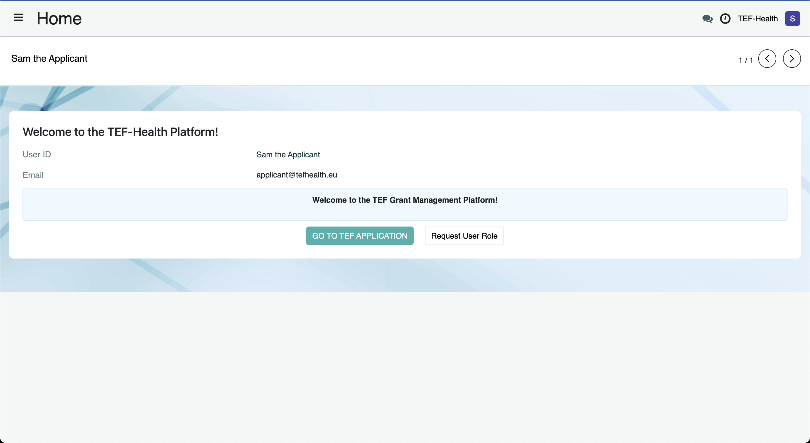
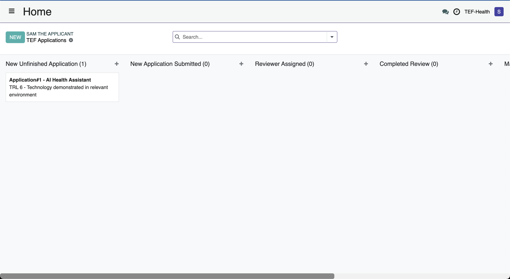
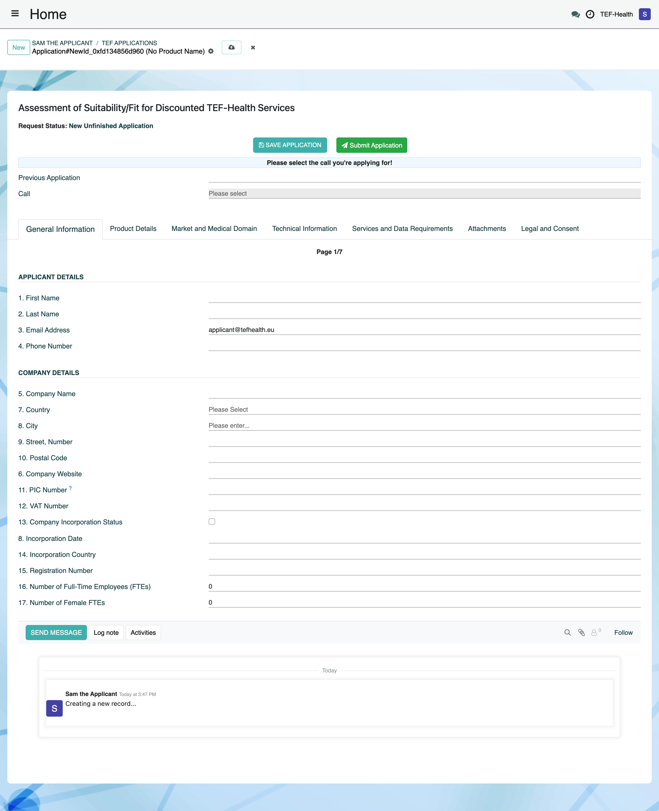

# Applicant Role Guide

As an **Applicant**, you can create, submit and manage TEF-Health grant applications.

## Creating a New Application
1. Navigate to the [Application Portal](https://tef.charite.de/application). Alternatively, log in to Odoo ([https://tef.charite.de/odoo](https://tef.charite.de/odoo)) and click **GO TO TEF APPLICATION**. 
2. A Kanban board opens that indicates the stage of each Application created by the User. Click the button **NEW** to create a new Application. 
3. A new Application form opens. Browse through the seven pages of the form to enter all information and save your progress at any time by clicking on **SAVE APPLICATION**. You can return later to continue filling the form before submission.

## Confirming Eligibility and Pre-Submission
1. Complete all required eligibility checks.
2. Once eligibility is confirmed, the **Submit** button becomes active.
3. Click **"Submit"** to finalize your application.
4. A **Front Office Agent** is notified about your submission.
5. Once submitted, applications **cannot be modified**.

_**Placeholder for Submission Confirmation Screenshot:**_

## Reusing Past Applications
- When creating a new application, you can **pre-fill data** from previous applications.
- Select an existing application to reuse relevant details, reducing effort.

_**Placeholder for Application Pre-Fill Screenshot:**_

## Notification and Review Process
- Applicants receive a **notification** once the application is shared with reviewers.
- Applications are reviewed under a **Non-Disclosure Agreement (NDA)** to ensure confidentiality.

## Retracting an Application
- Applicants can **retract applications** at any time if needed.
- A retracted application will no longer be considered in the review process.

_**Placeholder for Retraction Screenshot:**_

