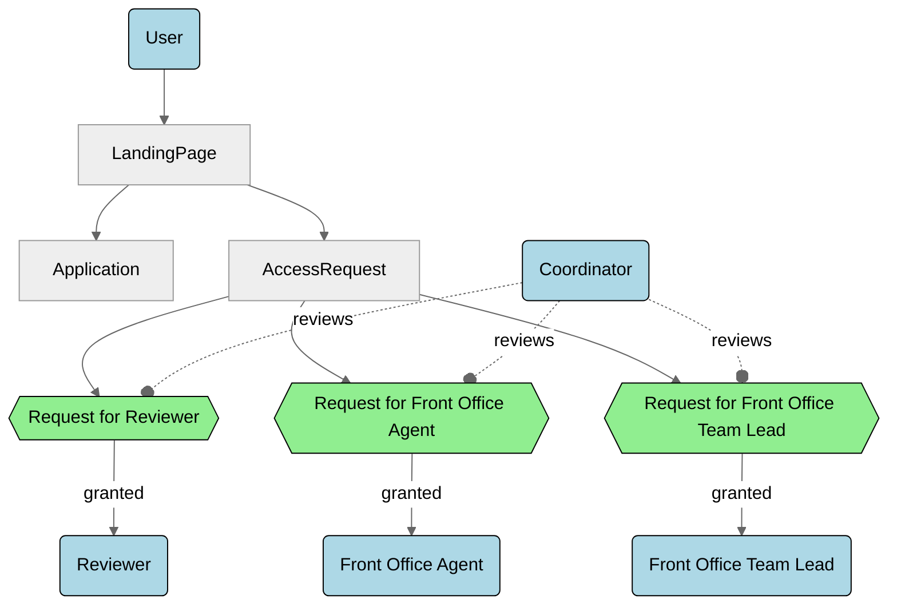

# Requesting Higher Roles

This section explains how users can request additional permissions beyond the base **Applicant** role. Users may either self-request a higher role or be invited. In both cases, specific additional information is required, which is then reviewed.

## Quickstart

**Request User Role** at [https://tef.charite.de/portal/access-request](https://tef.charite.de/portal/access-request).

!!! info "Invitation for higher roles"
    In certain cases, you may receive invitations to upgrade your role by an authorized user. Follow the steps in the invitation email to assume the higher role.

## Dependency Diagram (demo to add Leon's mermaid diagrams)

## Step by step

### Step 1: **Log into Odoo**
   Navigate to [https://tef.charite.de/portal/access-request](https://tef.charite.de/portal/access-request) and log in using your credentials.

### Step 2: **Complete the Role Request Form**
   Depending on the higher role you are requesting, you will need to provide the following information.

=== "Reviewer"
	* **Key Expertise:**
	Select your area(s) of expertise from a predefined choice list. This information helps the Front Office assign you to the appropriate applications.
	* **Reviewer Onboarding Form / Universal Expert Contract:**
	Complete the required form or sign the contract to confirm your onboarding as a reviewer.
	[Include a link or instructions for downloading and signing the document]
	* **Non-Disclosure Agreement (NDA):**
	Provide your consent via a checkbox or by signing and uploading a downloadable NDA document.
	* **Consent to Code of Conduct:**
	Read and agree to the TEF-Health Code of Conduct by checking the provided box.
	* **Consent to Working Arrangements:**
	Confirm that you accept the defined working arrangements (e.g., collaboration practices, timelines) by checking the appropriate box.
	* **Consent for Entry in the TEF-Health Reviewer Database:**
	Agree to have your details stored in the reviewer database for assignment and record-keeping purposes.
=== "Service Provider"
	1. Sed sagittis eleifend rutrum
	2. Donec vitae suscipit est
	3. Nulla tempor lobortis orci
=== "Funder"
	1. Sed sagittis eleifend rutrum
	2. Donec vitae suscipit est
	3. Nulla tempor lobortis orci

=== "Front Desk Agent"
	1. Sed sagittis eleifend rutrum
	2. Donec vitae suscipit est
	3. Nulla tempor lobortis orci
   _**Placeholder for Role Request Form Screenshot::**_
   

### Step 4: **Wait for approval**
   All role requests (self-submitted or via invitation) are reviewed by the Coordinator. Once reviewed, you will be notified whether your request is approved or if further information is required.