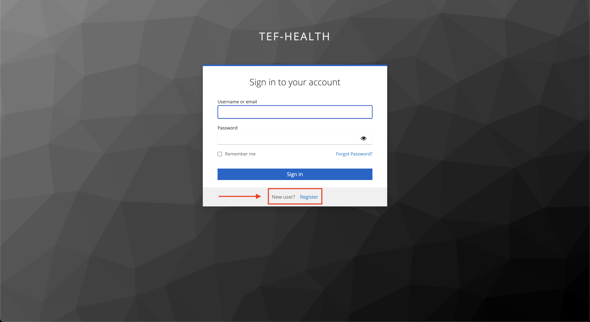
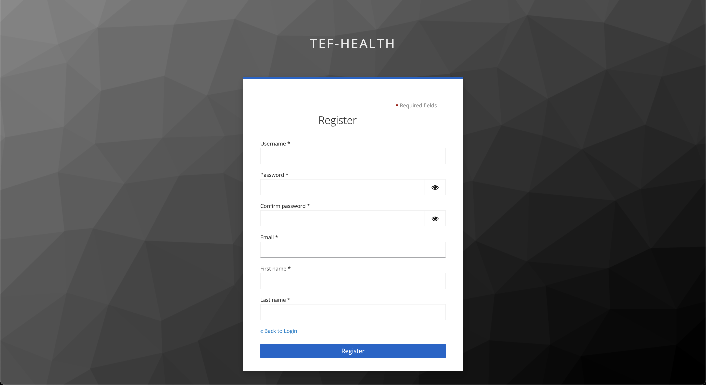
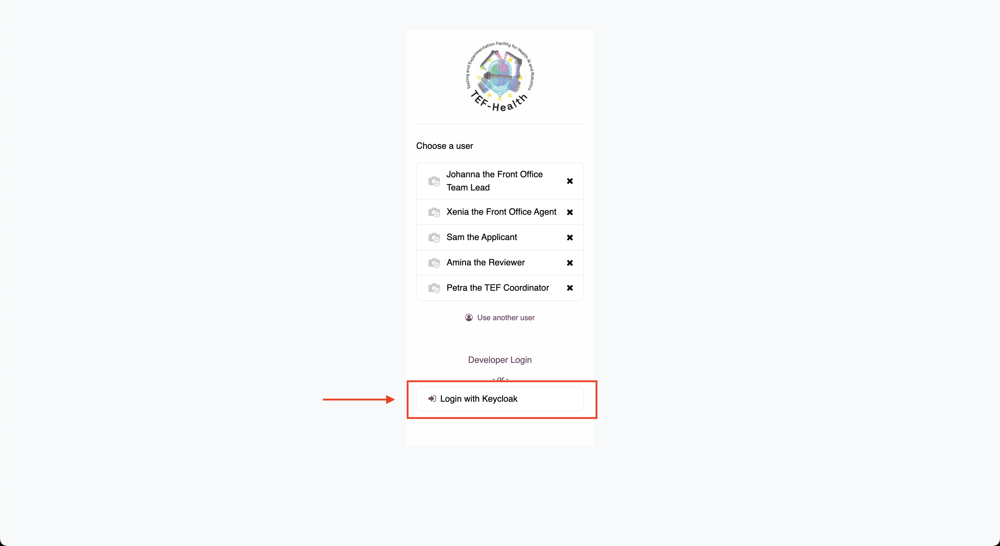
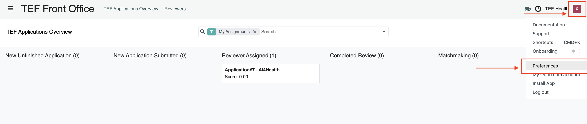
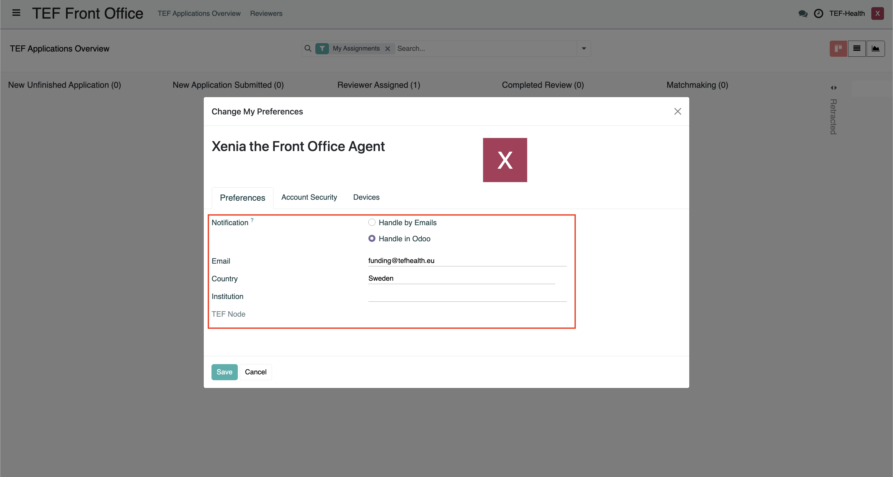

# Creating a User Account

This section explains how to obtain an account on the TEF-Health Platform [tefhealth.eu](https://tefhealth.eu)

## Quickstart

- **Registration:**  
  Register a TEF-Health account at [https://tef.charite.de/register](https://tef.charite.de/register)

- **Default Role:**  
  All new users receive the base role **"Applicant"** upon account creation. 

- **[Higher roles](permissions.md):**  
  can be requested via the TEF-Health Portal [https://tef.charite.de/portal/access-request](https://tef.charite.de/portal/access-request)
  
!!! info "Invitation to create account"
    New users can also be created by invitation. In this case an invitation email is sent to the prospective user. The email prompts them to reset their password. Follow the instructions to complete the password reset and activate the account.

---

## Step by step

### Step 1: Access the Registration Portal
- Open your web browser and navigate to the [TEF-Health Registration Page](https://tef.charite.de/register). TEF-Health Grant Management is performed using Odoo. When you register on the TEF-Health platform, an Odoo user account is automatically created.
- On the login page, click on "**Register**"

### Step 2: Complete the Registration Form
You will be asked to provide the following information:  
   
- **Name:** *Enter your full name.*  
- **Email:** *Provide a valid email address.*  
- **Password:** *Provide a secure password.*   
- **Country:** *Select your country of residence from the dropdown list.*  
- **Consent to Privacy Policy:** *Read the [Privacy Policy](https://tefhealth.eu/privacy-policy) and check the box to indicate your consent.*  
- **Consent to Email Marketing/Newsletters:** *Check the box if you wish to receive marketing emails or newsletters.*  

### Step 3: E-Mail Verification
After submitting the form, you will receive a verification email. Follow the instructions in the email to verify your email address. 

### Step 4: Logging into the TEF-Health Grant Management System
- Upon successful registration and email verification, a user account is automatically created using your TEF-Health platform details.   
   
- You can now **log into the TEF-Health Grant Management System at [https://tef.charite.de/odoo](https://tef.charite.de/odoo)**

- On the Odoo Login Page, click on "**Login with Keycloak**" and enter your credentials.

- Congratulations, you are now logged into the TEF-Health platform. Please note that users are automatically logged out after 10 minutes of inactivity.

### (Optional) Step 5: Requesting additional permissions
Your account is assigned the "Applicant" role by default. See the [next chapter](permissions.md) to request additional permissions beyond the default "Applicant" role.

## Updating Account Settings

To manage account settings, click the user icon (top right) and select Preferences from the dropdown menu.

In the Preferences tab, you can:

- Configure whether you wish to receive **email** or **Odoo platform notifications**.  
- Update your **email address**, **country**, and **institution**.  (the TEF-Health Node will be set automatically based on the institution)

 
 
- Click **Save** to ensure changes are retained.  