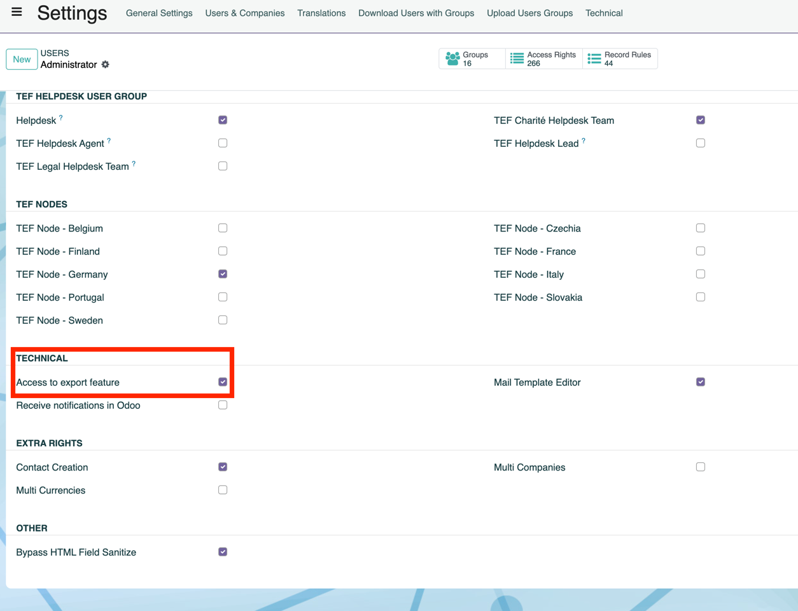
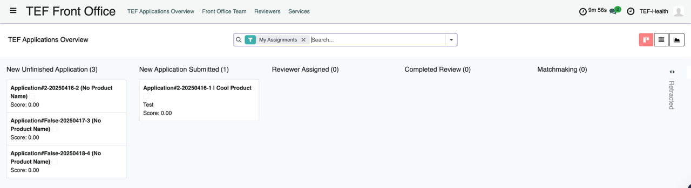
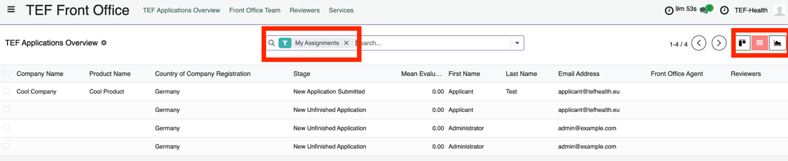
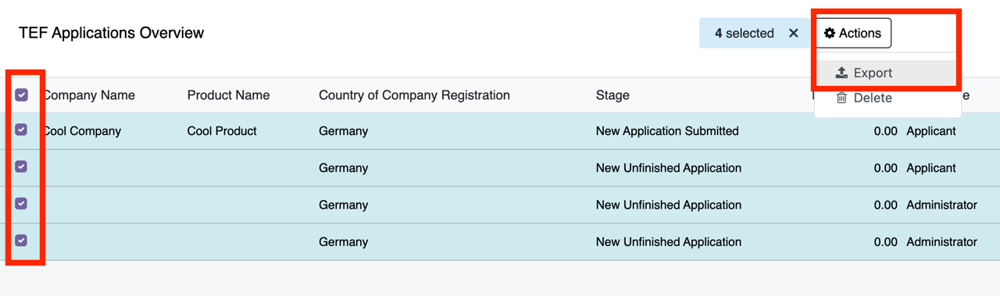
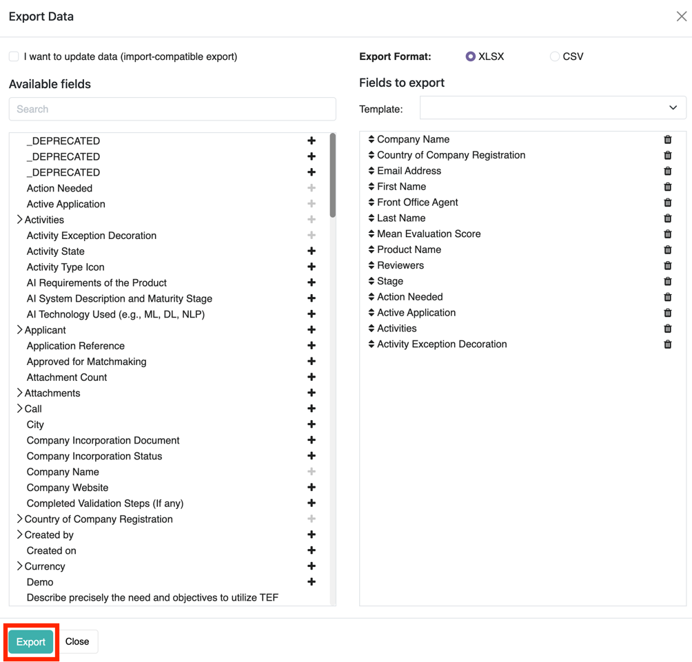
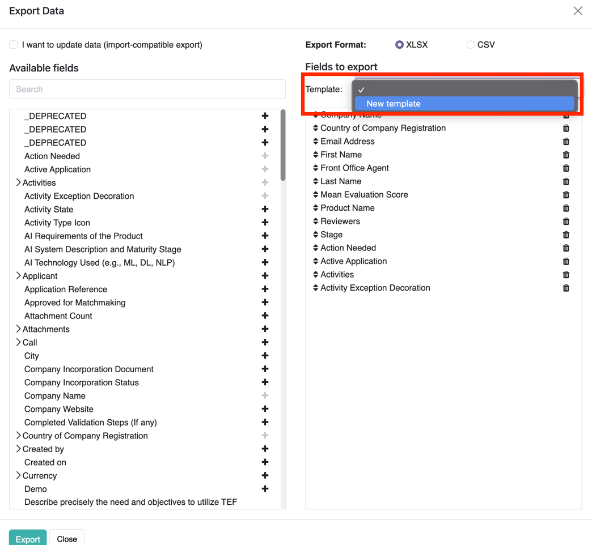

# Admin Guide

## Permission Management

### CSV Export

Admins can grant users to download the entire Odoo record as CSV.

!!! danger "Access to confidential information"
    The CSV export permission may only be granted to authorized users as it gives access to the full Odoo data record.
    
1. Activate Developer Mode by opening the General Settings page [https://tef.charite.de/odoo/settings](https://tef.charite.de/odoo/settings), scrolling to the bottom and clicking on **Activate the developer mode**.
2. Open the User Settings Page [https://tef.charite.de/odoo/users](https://tef.charite.de/odoo/users) and click on the user.
3. In the tab **Access Rights** scroll to **TECHNICAL** and select **Access to export feature**.  
    
    
## CSV Export

1. Go to Front Office Tab (Portal Backend) .
2. Select List view and (optional) deselect the My assignments filter to see all applications. .
3. Select all applications to download and press “Actions" and “Export” .
4. **Select fields relevant for analysis**: By pressing the plus button on the left side, add the fields to a column in the exported spreadsheet. If selection is completed, press export. .
5. Optional: Save selection as download template: This will save your selection so you do not have to put together all relevant fields again. .
