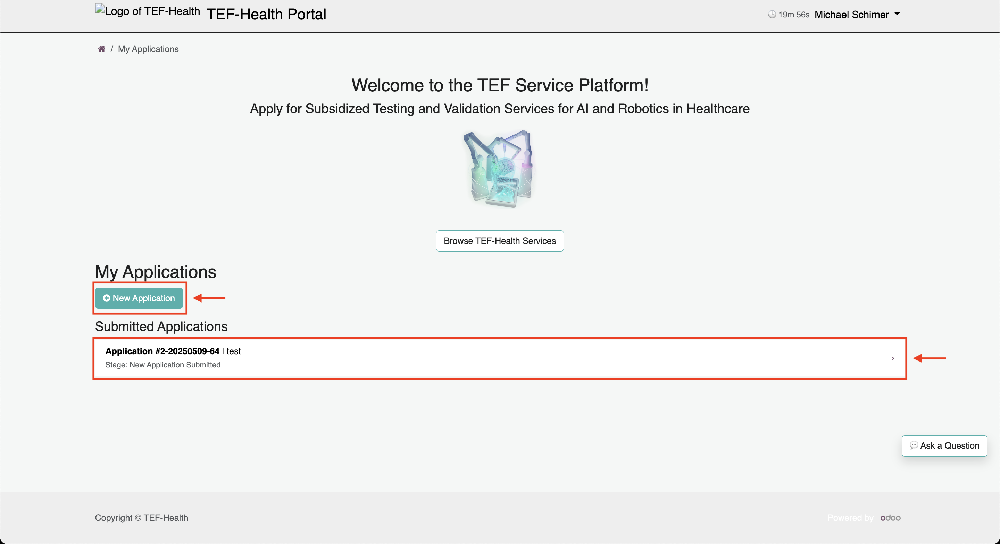
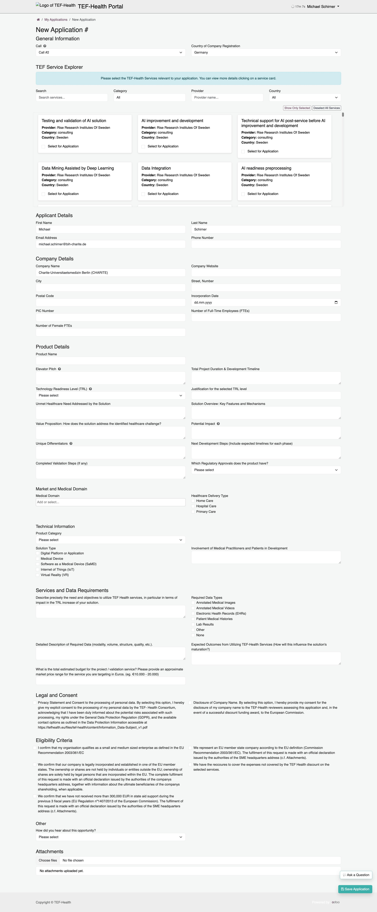
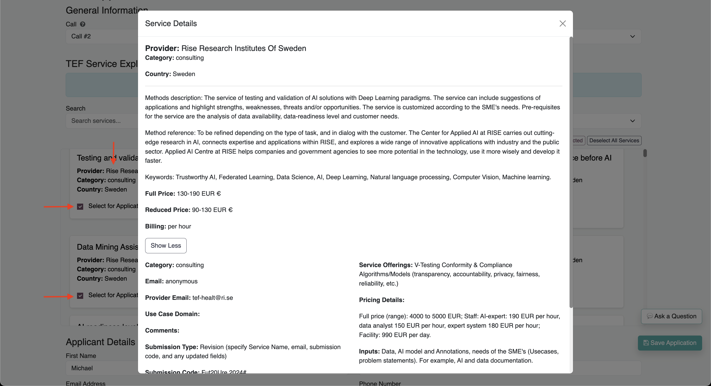
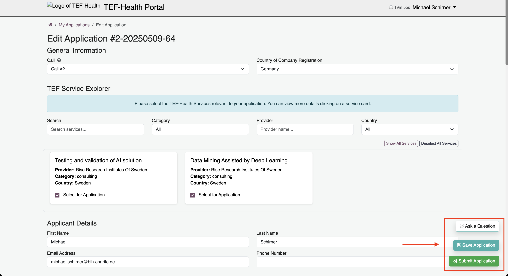

# Submitting an Application

Applicants **create, submit and manage** TEF-Health grant applications. After an application has been reviewed, Applicants can **communicate with Service Providers for contract negotiations**.

[Go to Application Portal](https://tef.charite.de/portal/applications){ .md-button target="_blank" }

!!! warning "Registration and Log-in"
    In case you are not yet logged in, you will be redirected to the log-in page.    Please log in with your TEF-Health platfrom credentials. If you have no user account, please [sign up for an account](accounts.md).

1. Navigate to the [Application Portal](https://tef.charite.de/portal/applications){target="_blank"} and click **New Application** to start a new Application or click on an old application under **Submitted Applications** to continue working on an application draft or to view correspondence of submitted applications. 
2. Fill in the Application Form. .
   - Check all Services for which you apply; click on a Service to view its details. .
3. Click on **Save Application** to store your progress and continue later. Click on **Submit Application** to submit it. Click on **Ask a Question** to chat with Support. .
