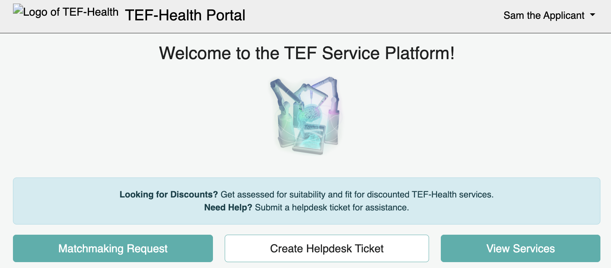
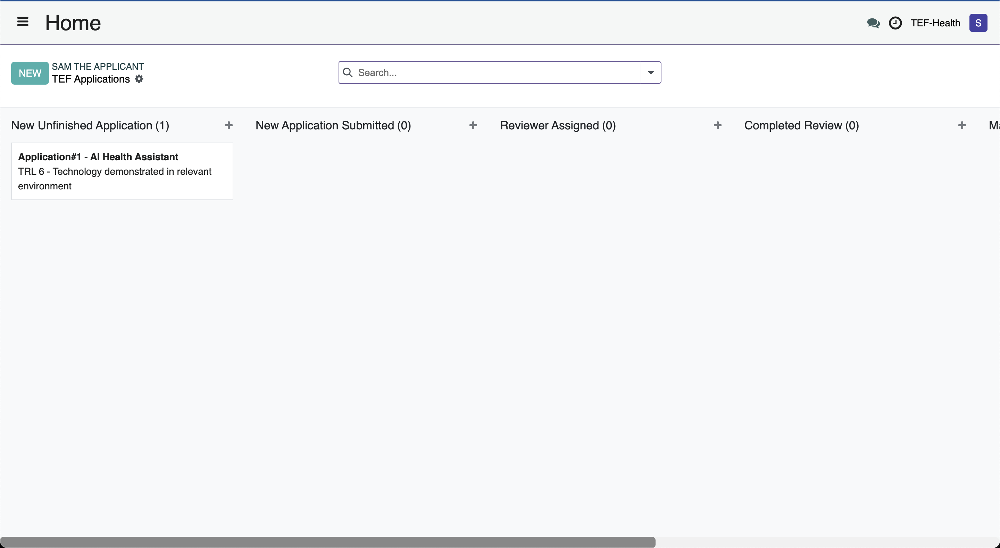
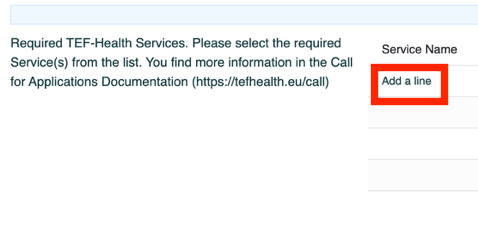
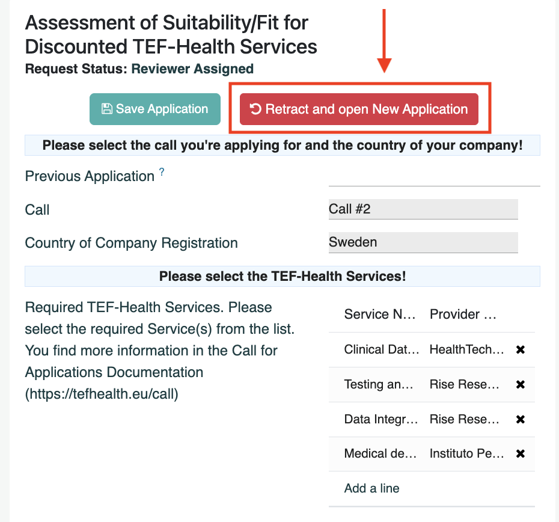

# Applicant Guide

Applicants **create, submit and manage** TEF-Health grant applications. After an application has been [reviewed](reviewer.md) and a match confirmed by the [Service Provider](service-provider.md), Applicants can **communicate with Service Providers for contract negotiations**.

## Creating a New Application
1. Navigate to the [Application Portal](https://tef.charite.de/portal/home) and click **Matchmaking Request**. 
2. A Kanban board opens that indicates the stage of each Application created by the User. Click the button **NEW** to create a new Application. 
3. The first part of the form allows to select a previous application in case you submitted an application before. Select the previous application in the field **Previous Application** to pre-fill the form with the information from this application. 

4. Next, the requested Services can be selected. Click on **Add a line** to open an overlay for selecting Services applicable for the selected Call from a list. Services can be added to the Application by clicking on the line of the Service. Alternatively, Services can be added by checking the checkboxes and clicking on the button **Select** at the bottom of the overlay. Furthermore, it's possible to create an entirely new Application by clicking on the button **Create Application** at the top of the overlay.

The displayed Services are filtered by Call.

Clicking on the Info button opens the Service Description Card of the [Service Catalogue](service-catalogue.md). 

5. Upon selecting the Call, a second form to the right opens where further information is requested. Browse through the tabs of the form to enter all requested information. Save your progress at any time by clicking on **SAVE APPLICATION**. You can return later to continue filling the form before submission.

6. Applicants must confirm all required eligibility checks. Once eligibility is confirmed, the **Submit** button becomes active. Click **"Submit"** to send your application to the Front Office and a [Front Office Agent](front-office.md) is notified about your submission.

7. Once submitted, applications **cannot be modified**. Applicants receive a **notification** once the application is shared with reviewers. Applications are reviewed under a **Non-Disclosure Agreement (NDA)** to ensure confidentiality.
8. Applicants can **retract applications** at any time. A retracted application will no longer be considered in the review process.

!!! info "Reusing old applications"
    When creating a new application, you can **pre-fill data** from previous applications. Select an existing application to reuse relevant details, reducing effort.
