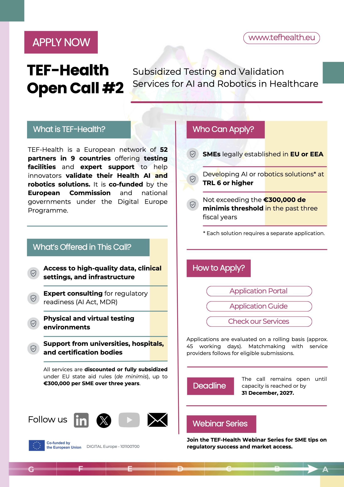

# Call 2—Services by TEF-Health partners from multiple European member states

## Apply for Call#2

[TEF-Health Call#2 Info PDF](https://tefhealth.eu/files/tef-health/content/Calls/Call-2/TEF-Health_Call%232_Application-Details_20250331_v1.pdf){ .md-button target="_blank" }

[Apply Now for Call#2 Service Discounts](https://tef.charite.de/docs/call/applicant/){ .md-button target="_blank" }

[Register for Call#2 Webinars](https://tefhealth.eu/news-progress/details/call-2-webinar-series){ .md-button target="_blank" }

## TEF-Health Webinars on Call #2

### Petra Ritter - Introduction of TEF Health & Call#2

<iframe width="560" height="315" src="https://www.youtube.com/embed/EBHaCmjYYDU?si=zQI3uX86vmz0xAIy" title="YouTube video player" frameborder="0" allow="accelerometer; autoplay; clipboard-write; encrypted-media; gyroscope; picture-in-picture; web-share" referrerpolicy="strict-origin-when-cross-origin" allowfullscreen></iframe>

### Manuel Bragança Pereira - Case Study from Call#1

<iframe width="560" height="315" src="https://www.youtube.com/embed/z3aldIOuqCg?si=Ig13Zj5Q3AiREkGN" title="YouTube video player" frameborder="0" allow="accelerometer; autoplay; clipboard-write; encrypted-media; gyroscope; picture-in-picture; web-share" referrerpolicy="strict-origin-when-cross-origin" allowfullscreen></iframe>

