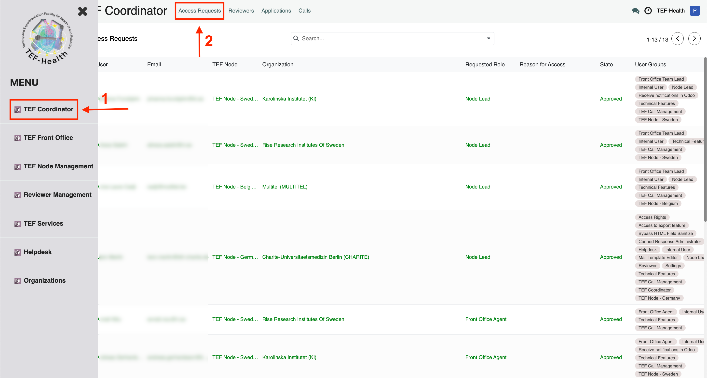
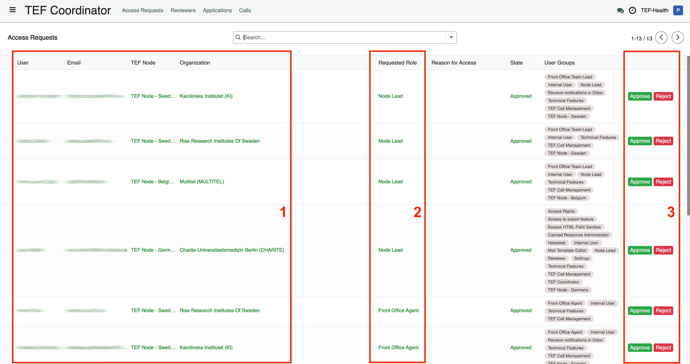
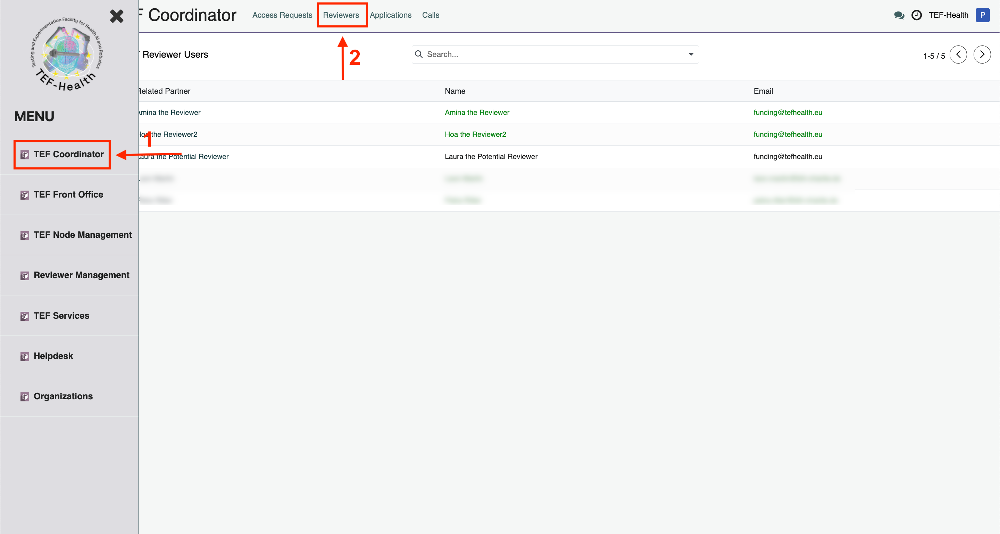
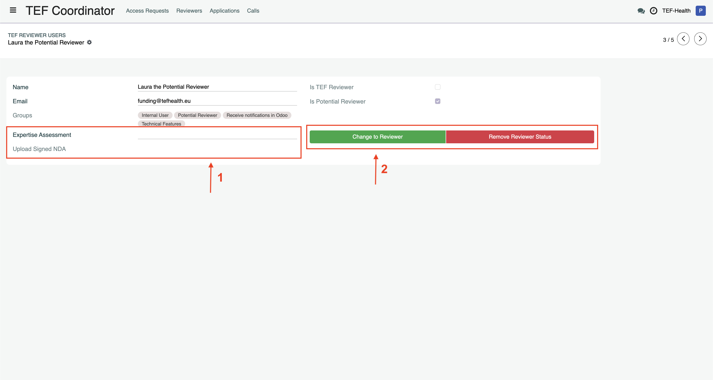
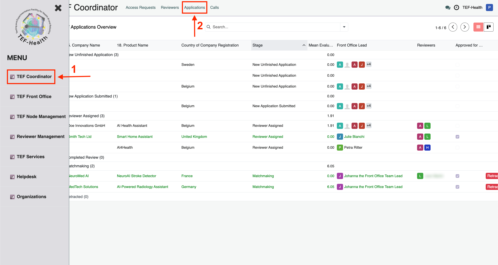
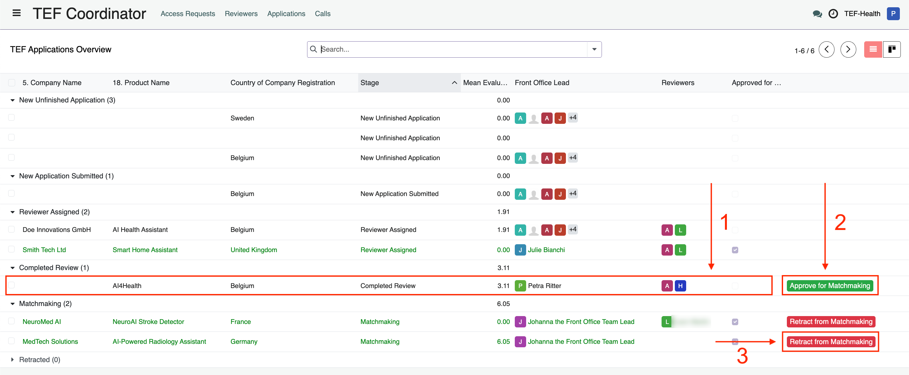
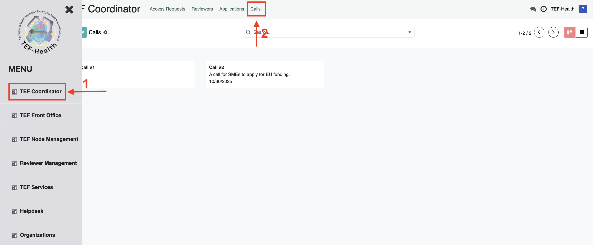
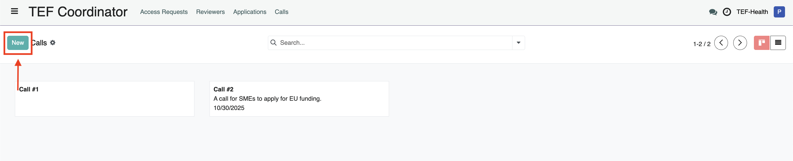
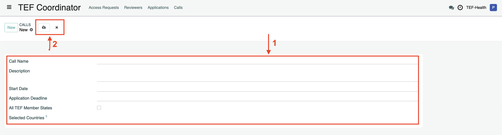

# Coordinator Guide

The Coordinator 

- **handles access requests** for higher roles  
- **adds or removes Reviewers** to the reviewer database   
- **approves matchmakings**
- and **starts calls**.

## Access Requests

### Request by user

When users [request higher roles](permissions.md) the Coordinator receives a notification. The Coordinator confirms or denies the requested user role, ensuring the user has appropriate access to the platform's features.

1. Open the **Access Request** view of the Coordinator Dashboard by clicking on the button **TEF Coordinator** in the left-hand menu and then on **Access Requests** in the top navigation bar.    
2. Review the user information (1) and the requested role (2). Click **Approve** or **Reject** to grant or reject the requested role. The field *State* and the color of the line change depending on the status of the user.    

### Invitation by Coordinator

In addition to requests initiated by the user, the Coordinator can invite users to higher roles.

TBD 

1. ...
2. ...
3. ...

## Reviewers

A contract is formed between each Reviewer and TEF-Health coordinator Charité. The Coordinator grants the role **Reviewer** after confirming that the contract was signed.

!!! note "Reviewer Contract"
    Only after the Reviewer Contract has been countersigned by a Charité legal representative, the user is added to the **Reviewers Database**. While the request is pending, the user will get the role **Potential Reviewer**.

1. Open the **Reviewers** view of the Coordinator Dashboard by clicking on the button **TEF Coordinator** in the left-hand menu and then on **Reviewers** in the top navigation bar.    
2. Click on a list item to open the details of a Reviewer request. Review the Expertise Assessment and the uploaded and signed Contract. Click **Change to Reviewer** to approve the request.   

## Applications

After Reviewers provided scores for an application, the Coordinator confirms the matchmaking, allowing Applicants and Service Providers to commence contract negotiations.

1. Open the **Applications** view of the Coordinator Dashboard by clicking on the button **TEF Coordinator** in the left-hand menu and then on **Applications** in the top navigation bar.   
2. Review the application information by clicking (1) on a list item under **Completed Review** to see all Application details. Click **Approve for Matchmaking** (2) to allow matchmaking.     
3. Retract Matchmakings by clicking on **Retract from Matchmaking** on the list items under the section **Matchmaking**.

## Calls

The Coordinator initiates new calls.

1. Open the **Calls** view of the Coordinator Dashboard by clicking on the button **TEF Coordinator** in the left-hand menu and then on **Calls** in the top navigation bar.   
2. Start a new call by clicking on the button **New**       
3. Fill out the required information for the call and click Save (the cloud icon) or on Discard (the cross) near the top. Upon clicking Save the Node Leads and Service Providers will receive the notification requesting their respective confirmations (Node Leads must confirm overall Call details, Service Providers must confirm the inclusion of their Services into the Call).   
**Required Information to Start a Call:**

    - Opening Date: When the call becomes active.
    - Closing Date or Condition: E.g., target service provisions or total discount volume.
    - Timelines for Internal Processes:
        - Application evaluation timeline.
        - Call updates (e.g., adding nodes and services).
    - Evaluation Criteria: Standards for assessing applications.
    - Participating Country Approval: Confirmation by Node Leaders upon call draft creation.
    - Participating Services Approval: Confirmation by Service Providers after Node Leaders' approval.   

4. Modify existing Call records by clicking on a Call, changing the information and clicking on Save (cloud icon) near the top.

## Additional Permissions

### Service Catalogue Management

Coordinators can veto Service Catalogue updates by Service Providers.

### Helpdesk Management

Coordinators can  

- View all helpdesk tickets,  
- Assign helpdesk agents to tickets,  
- Respond to helpdesk tickets as necessary.

### Application Oversight

Coordinators can

- View all applications and reviews.
- Assign reviewers to applications.
- Reject applications if necessary.
