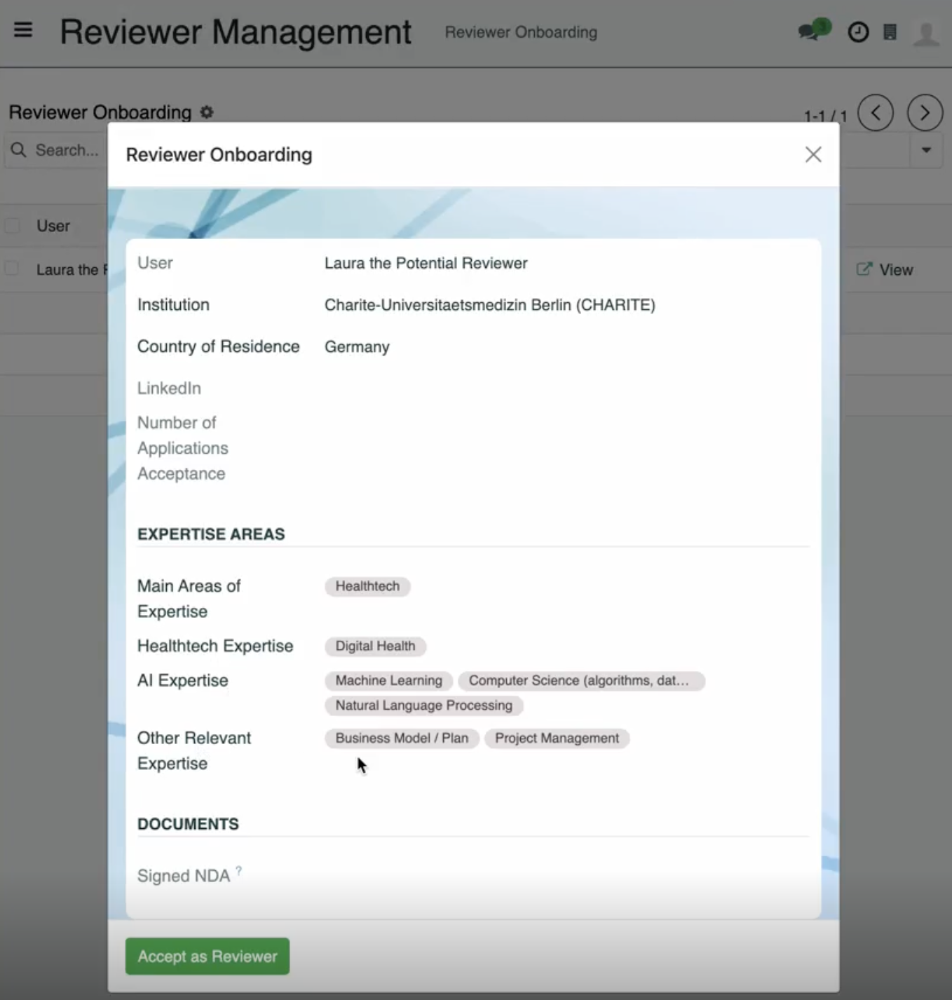
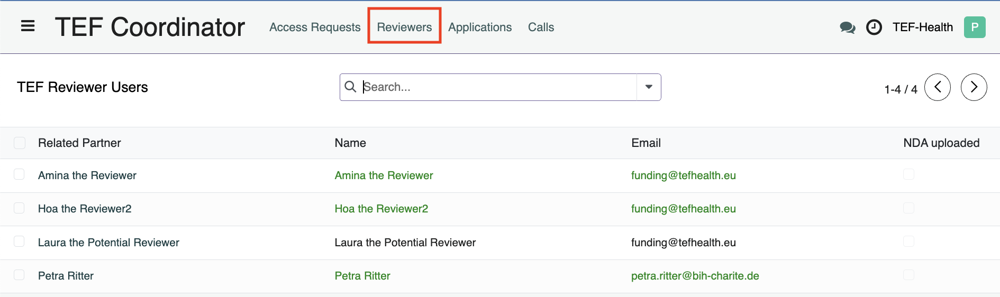
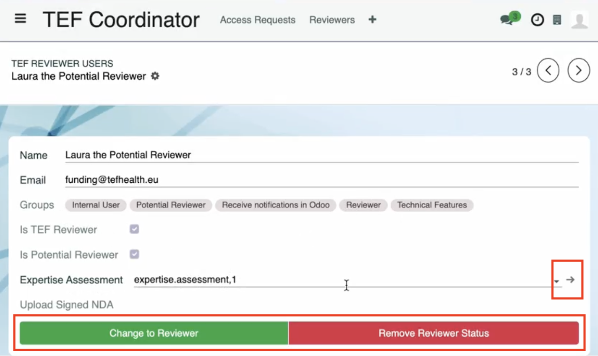
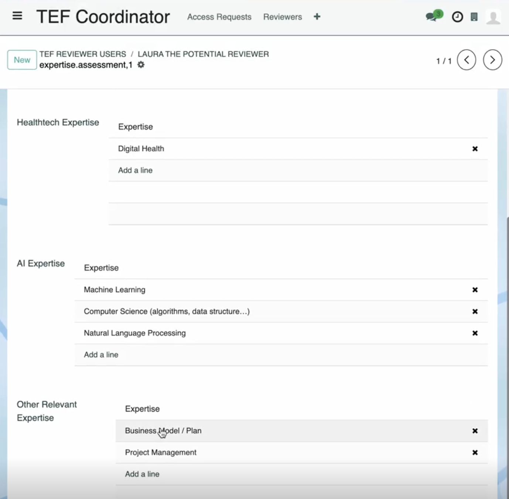
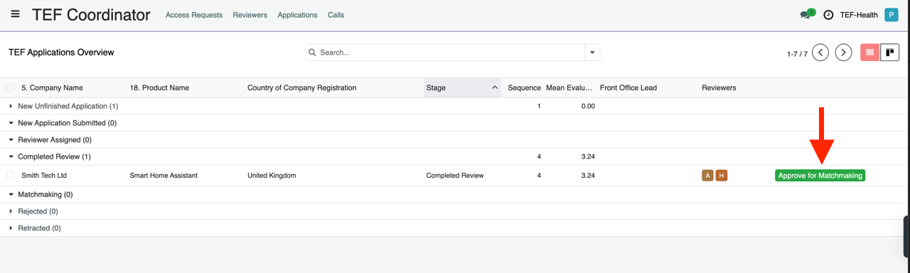
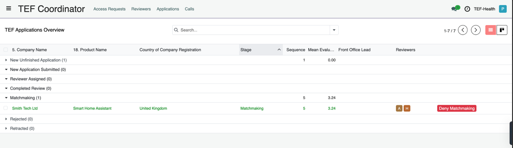

# Coordinator Guide

The Coordinator **grants user permissions, approves matchmakings, and starts calls**. The Coordinator holds the highest level of permissions within the TEF-Health Platform. 

## User Management

### Granting User Permissions and Roles

When users [request higher roles](permissions.md) the Coordinator receives a notification. The Coordinator confirms or denies the requested user role, ensuring the user has appropriate access to the platform's features.

### Reviewer Management (Onboarding)

1. Upon receiving a **Reviewer Onboarding Notification**, navigate to the **Reviewer Management View** (left-hand menu).
2. Click on each pending review request item in the list to open its details.
3. Verify the information and click on **Accept as Reviewer** to add the Reviewer to the Reviewer Database.

### Reviewer Management (Reviewer Database)

1. Upon onboarding, Reviewers in the Reviewer Database are managed via the Coordinator View button **Reviewers** (top navigation bar).

2. Clicking on a list entry allows to change the Reviewer status.

3. Clicking on the small arrow next to *Expertise Assessment* allows to open a view for modifying the expertise.

### Front Office Leads and Groups Management

Coordinators assign Users the role "Front Office Lead" to facilitate the formation of Front Office Groups.

- **Assigning Front Office Roles:**  
    - Assign Front Office Leads.  
    - Assign Front Office Agents to groups and applications.  

1. Navigate to ...
2. Select the user from
3. ...

### User Invitations and Role Assignments

Coordinators can invite new users to the platform and directly assign them specific roles.

1. Navigate to ...
2. Enter the user's email address and select the role to be assigned.
3. Send the invitation; the user will receive an email to confirm and activate their account.

## Managing Calls

### Starting a Call

Coordinators initiate new calls.

**Required Information to Start a Call:**

- Opening Date: When the call becomes active.
- Closing Date or Condition: E.g., target service provisions or total discount volume.
- Timelines for Internal Processes:
  - Application evaluation timeline.
  - Call updates (e.g., adding nodes and services).
- Evaluation Criteria: Standards for assessing applications.
- Participating Country Approval: Confirmation by Node Leaders upon call draft creation.
- Participating Services Approval: Confirmation by Service Providers after Node Leaders' approval.

### Approving Matchmaking

After reviewers provide scores for an application, the Coordinator confirms the matchmaking, allowing applicants and service providers to commence contract negotiations.

## Additional Responsibilities

### Service Catalogue Management

Coordinators can veto Service Catalogue updates by Service Providers.

### Helpdesk Management

Coordinators can  

- View all helpdesk tickets,  
- Assign helpdesk agents to tickets,  
- Respond to helpdesk tickets as necessary.

### Application Oversight

Coordinators can

- View all applications and reviews.
- Assign reviewers to applications.
- Reject applications if necessary.
