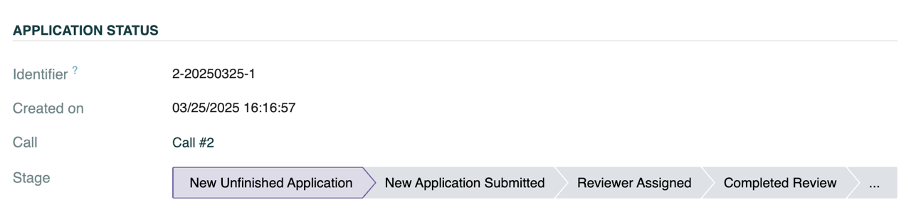
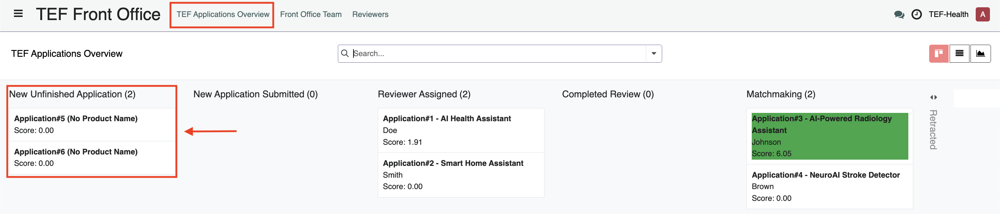
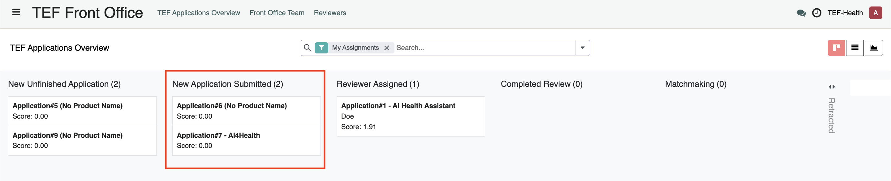
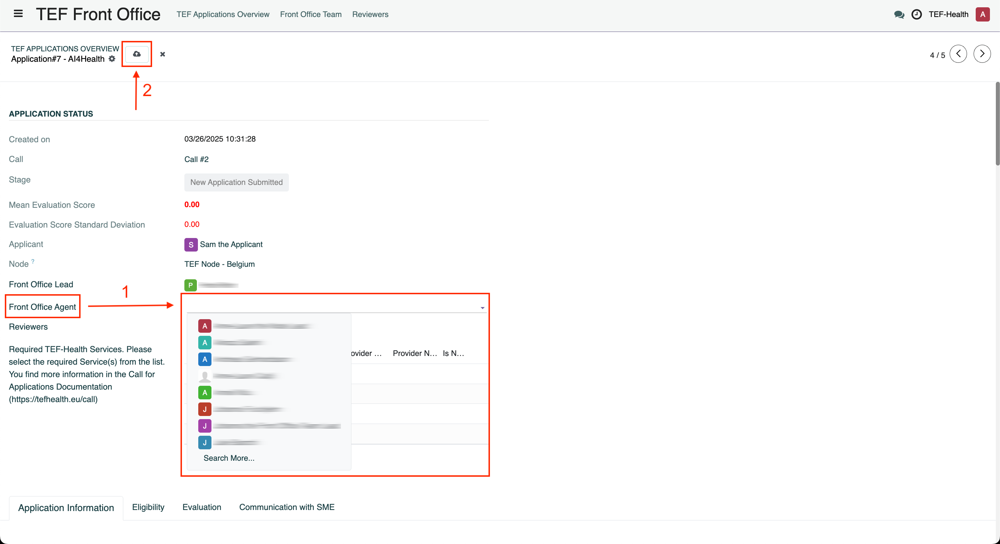
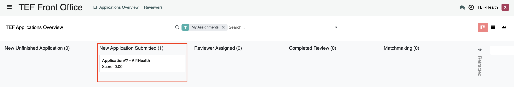
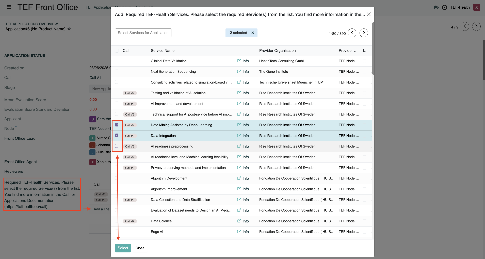
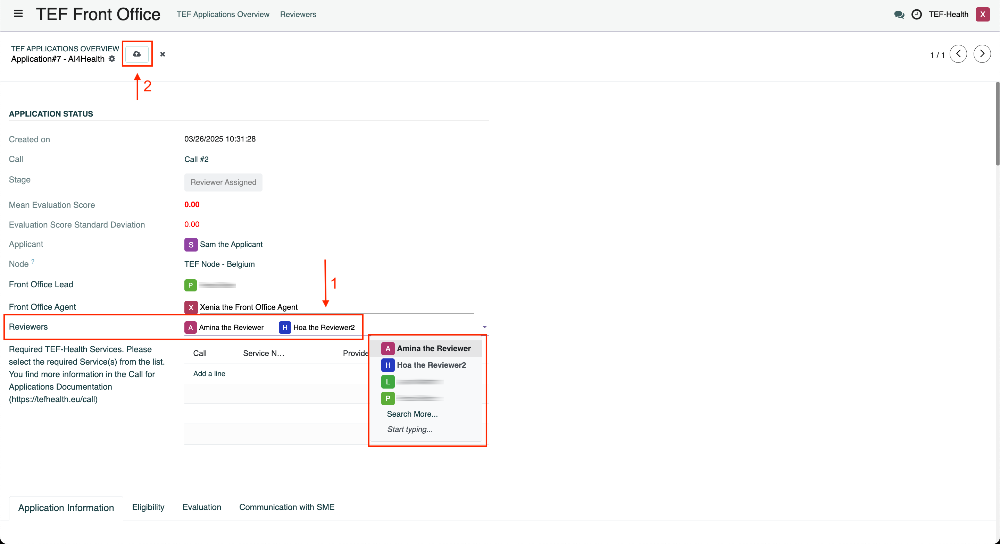

# Front Office Guide

Front Offices **handle incoming applications, assign reviewers and write reports on service provisioning**.

!!! warning "Signed Joint Controllership Agreement"
    The processing of personal data can only commence after the Joint Controllership Agreement has been signed, both in physical and digital formats.

## Front Office Structure

### National Front Offices

The Front Office is organized into groups based on two characteristics, **Node** and **Call**, forming **National Front Offices**. For example:

- **Call2-Sweden**: Represents the Swedish Node for Call #2.
- **Call3-Sweden**: Represents the Swedish Node for Call #3.

This grouping ensures that each node can manage applications specific to their country (or countries) and the particular call.

National Front Offices consist of **Front Office Leads** and **Front Office Agents**.

### Front Office Leads

Front Office Leads are assigned by Node Leads. Their primary responsibilities include:

- **Assigning Front Office Agents:**  
  Allocate Front Office Agents to Front Office Groups and specific applications.
- **Monitoring Applications:**  
  Oversee all applications and reviews within their group.
- **Receiving Notifications:**  
  Be alerted when new applications are pre-submitted or when an agent declines an assignment due to a conflict of interest.
  
Front Office Leads get an overview over the Front Office Team by clicking on the button **Front Office Team** on the top navigation bar.

### Front Office Agents

Front Office Agents are assigned to National Front Offices by Front Office Leads. Their main tasks involve:

- **Reviewer Assignment:**  
  Select appropriate reviewers for applications based on expertise.
- **Application Submission:**  
  Submit applications to the assigned reviewers.
- **Conflict of Interest Management:**  
  Decline application assignments if a conflict of interest exists.
- **Post-Provisioning Surveys:**  
  Complete surveys after service provisioning to gather valuable feedback.

## Application Review Workflow

The Front Office follows a structured process to ensure fair and accurate review of applications. Front Office staff can access Applications via the left-hand menu item **TEF Front Office**. In addition, a notification informs a Front Office Agent about an application assignment. Front Office Agents can view Applications in a Kanban view, that shows the stage of the Application. 

Alternatively, the Applications can be viewed as list.  

    
!!! warning "Filter settings"
    By default a filter is active that only shows Applications from your Node. Remove the filter by clicking on the cross to see all Applications.

The workflow is divided into several key steps, which can be monitored by the progress bar in each Application record, or by its position on the Kanban board.

### Step 1: New Unfinished Application 

Front Office Leads (and Node Leads) can monitor Application drafts by the Applicant before they are submitted. No action by the Front Office is required.

### Step 2: New Application Submitted

#### Actions by Front Office Lead

When Applicants submit an Application, the Front Office Lead receives a notification. To assign Front Office Agents to the Application, the Lead performs the following steps:

1. Open the Application by clicking on it under the column **New Application Submitted** or by clicking on the link in the notification. 
2. Click on the field **Front Office Agent** and select one Agent. 
3. Click on the **Save** button to save the change. 
4. The Agent receives a Notification about their assignment.

#### Actions by Front Office Agent

!!! warning "Conflicts of interest"
    **Do not proceed with application handling if a conflict of interest exists according to the [Code of Conduct](#).** In case you decline, the Front Office Lead will get a notification and reassign the application to another agent.

The Front Office Agent receives a notification about their assignment and opens it by clicking on the link in the notification or by clicking on the Application under the Kanban column **New Application Submitted**.

Upon receiving a new Application the agent should:

- **Review the Assignment:**  
  Carefully check the assignment for any potential conflict of interest according to the [Code of Conduct](#).
- **Decline if Necessary:**  
  If a conflict is detected, decline the assignment immediately by clicking the button **Decline Assignment**.
  

!!! info "Additional Services"
    Front Office Agents have the ability to add additional Services to an Application. To add additional Services, click on **Add a Line** at the field **Required TEF-Health Services** and select the checkboxes of the Services in the opening overlay. Confirm by clicking **Select**. 

### Step 3: Reviewer Assigned

Front Office Agents must assign **two reviewers** from the Reviewers group.  
Assignments are made based on the reviewers' expertise to ensure a thorough evaluation.

> **Reference:** See the [Reviewer Assignment Guidelines](#) for detailed criteria.

Once reviewers submit their evaluations, the system calculates the **standard deviation** of their scores:

- **Standard Deviation ≤ 4:**  
  The application proceeds based on the two reviews.
- **Standard Deviation > 4:**  
  A notification prompts the assignment of a **third reviewer** to ensure an accurate assessment.
  
#### Actions by Front Office Agent

To assign Reviewers, perform the following steps:

1. Open the Application by clicking on it in the Kanban column **New Application Submitted**   
2. Click on the field **Reviewers** and select two Reviewers. 
3. Click on the **Save** button to save the change. 

### Step 4: Completed Review, Matchmaking and Post-Provisioning Survey

#### Actions by Front Office Agent

After service provisioning is complete, Front Office Agents receive a notification prompting them to complete the **Post-Provisioning Survey**. This feedback is essential for continuous process improvement.

## Additional Resources

For further guidance, please refer to:

- [Reviewer Assignment Guidelines](#)
- [Conflict of Interest Policy](#) / [Code of Conduct](#)
- [Post-Provisioning Survey Instructions](#)

