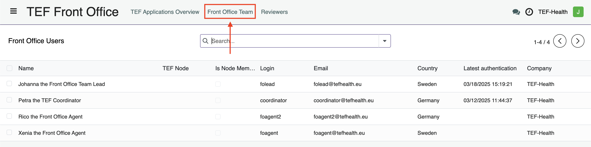

# Front Office Guide

Front Offices **handle incoming applications, assign reviewers and write reports on service provisioning**.

!!! warning "Signed Joint Controllership Agreement"
    The processing of personal data can only commence after the Joint Controllership Agreement has been signed, both in physical and digital formats.

## Front Office Structure

### National Front Offices

The Front Office is organized into groups based on two characteristics, **Node** and **Call**, forming **National Front Offices**. For example:

- **Call2-Sweden**: Represents the Swedish Node for Call #2.
- **Call3-Sweden**: Represents the Swedish Node for Call #3.

This grouping ensures that each node can manage applications specific to their country (or countries) and the particular call.

National Front Offices consist of **Front Office Leads** and **Front Office Agents**.

### Front Office Leads

Front Office Leads are assigned by Node Leads. Their primary responsibilities include:

- **Assigning Front Office Agents:**  
  Allocate Front Office Agents to Front Office Groups and specific applications.
- **Monitoring Applications:**  
  Oversee all applications and reviews within their group.
- **Receiving Notifications:**  
  Be alerted when new applications are pre-submitted or when an agent declines an assignment due to a conflict of interest.
  
Front Office Leads have an overview over their Team.

To assign Front Office Agents, Leads perform the following steps.

1. ...
2. ...
3. ...

### Front Office Agents

Front Office Agents are assigned to National Front Offices by Front Office Leads. Their main tasks involve:

- **Reviewer Assignment:**  
  Select appropriate reviewers for applications based on expertise.
- **Application Submission:**  
  Submit applications to the assigned reviewers.
- **Conflict of Interest Management:**  
  Decline application assignments if a conflict of interest exists.
- **Post-Provisioning Surveys:**  
  Complete surveys after service provisioning to gather valuable feedback.

## Application Review Workflow

The Front Office follows a structured process to ensure fair and accurate review of applications. The workflow is divided into several key steps:

### Step 1: Conflict of Interest Management

Front Office Staff can access Applications via the left-hand menu item **TEF Front Office**. In addition, a notification informs a Front Office Agent about an application assignment.
Upon receiving a new application the agent should:

- **Review the Assignment:**  
  Carefully check the assignment for any potential conflict of interest.
- **Decline if Necessary:**  
  If a conflict is detected, decline the assignment immediately.
- **Reassignment:**  
  The Front Office Lead will reassign the application to another agent.

!!! warning "Important"
    **Do not proceed with reviewer assignment if a conflict of interest exists.**

Front Office Agents can view Applications in a Kanban view, that shows the stage of the Application.

Alternatively, applications can be viewed as list.  

    
!!! warning "Filter settings"
    By default a filter is active that only shows Applications from your Node. Remove the filter by clicking on the cross to see all Applications.

### Step 2: Reviewer Assignment

Upon receiving a new application, Front Office Agents must assign **two reviewers** from the Reviewers group.  
Assignments are made based on the reviewers' expertise to ensure a thorough evaluation.

> **Reference:** See the [Reviewer Assignment Guidelines](#) for detailed criteria.

### Step 3: Review Process

Once reviewers submit their evaluations, the system calculates the **standard deviation** of their scores:

- **Standard Deviation ≤ 4:**  
  The application proceeds based on the two reviews.
- **Standard Deviation > 4:**  
  A notification prompts the assignment of a **third reviewer** to ensure an accurate assessment.

### Step 4: Post-Provisioning Survey

After service provisioning is complete, Front Office Agents receive a notification prompting them to complete the **Post-Provisioning Survey**. This feedback is essential for continuous process improvement.

## Additional Resources

For further guidance, please refer to:

- [Reviewer Assignment Guidelines](#)
- [Conflict of Interest Policy](#)
- [Post-Provisioning Survey Instructions](#)

