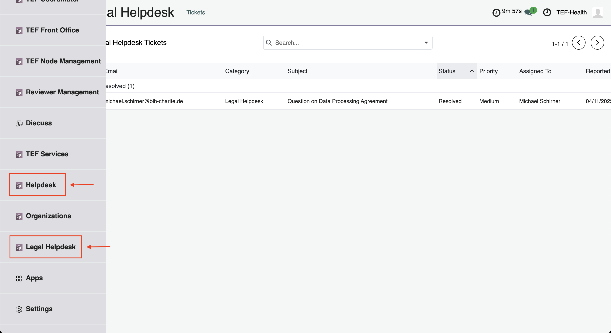
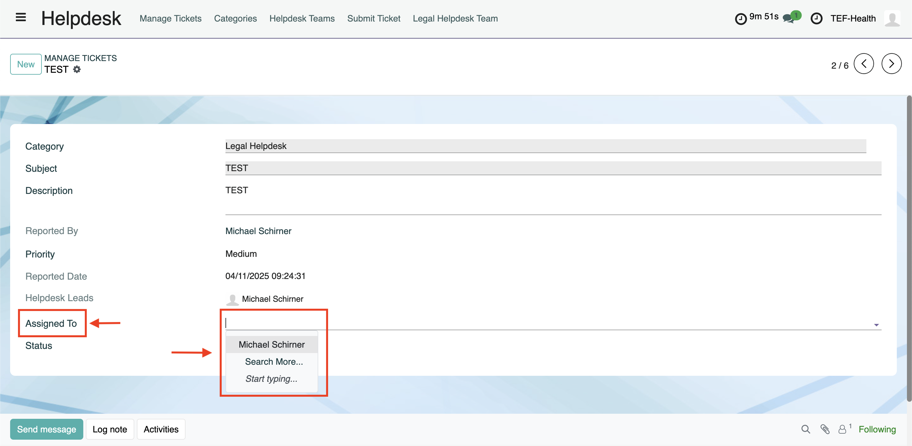
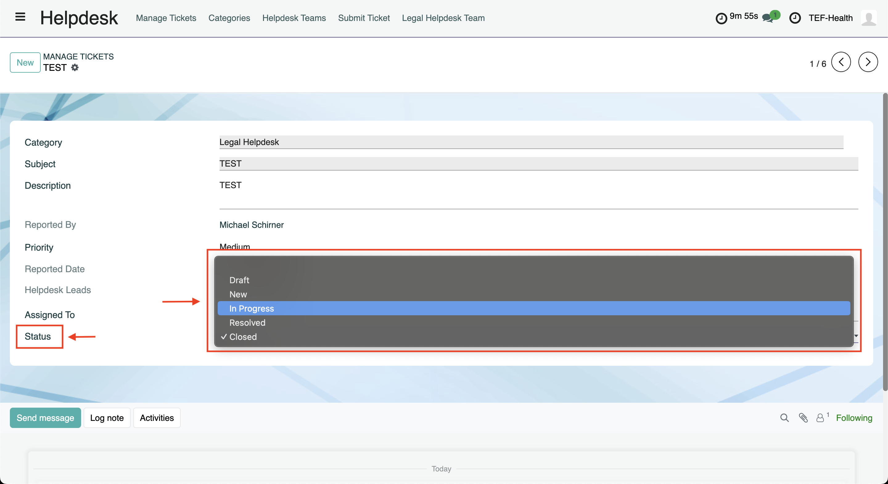
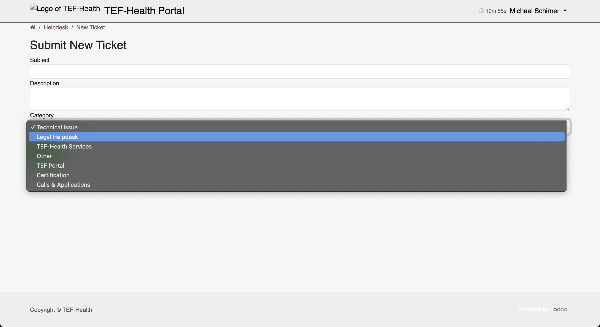
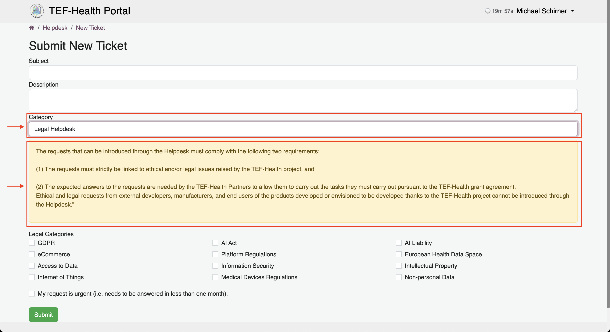
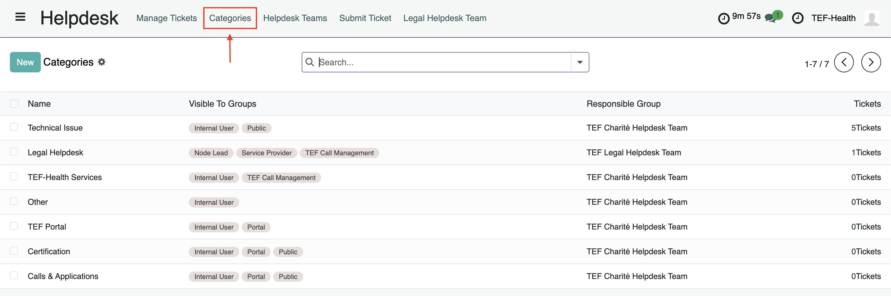
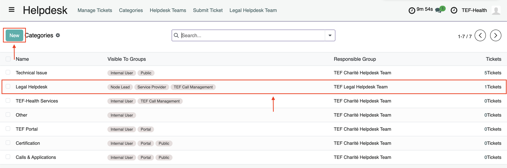
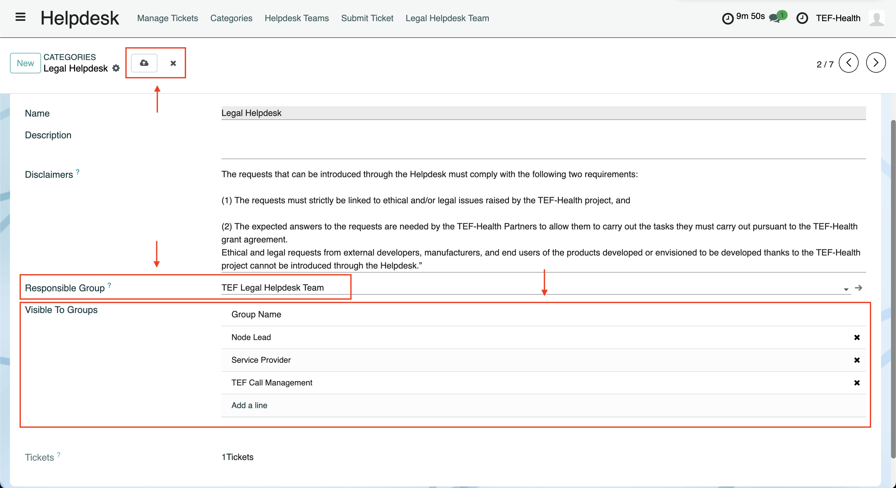

# Internal Helpdesk

Via the **TEF-Health Helpdesk** users submit **Support Requests** and interact with **Helpdesk Agents**. 

## Helpdesk Roles and Groups

The following Helpdesk Roles exist:

- Helpdesk
- TEF Helpdesk Agent
- TEF Legal Helpdesk Team
- TEF Charité Helpdesk Team
- TEF-Helpdesk Leads

### TEF Helpdesk Agents

Helpdesk Agents  

- **Receive notifications** when they were assigned (by a TEF-Helpdesk Leads) to a ticket or when a user updates a ticket. 
- **Assign tickets** to other team members if they cannot answer the request.  
- **Change ticket status** based on progress.  
- **Reply to tickets** via the chatter, triggering notifications.  
- Mark tickets as **Resolved** when an issue is fixed.  
  

### TEF-Helpdesk Leads

TEF-Helpdesk Leads

- **Receive notifications** when a user creates a ticket for their Team. 
- **Review submitted tickets and responses**. 
- **Assign tickets** to TEF Helpdesk Agents of their Team.  
- **Define Support Categories** and **Add Groups to Categories**

### Helpdesk Teams

**Helpdesk Agents** form **Helpdesk Teams** that address different **Categories of Support Requests** and that are led by **TEF-Helpdesk Leads**. For example, the team **TEF Legal Helpdesk Team** addressing questions from Service Providers.

## Accessing the Helpdesk

### To submit tickets

1. Browse to [https://tef.charite.de/helpdesk](https://tef.charite.de/helpdesk).
2. Alternatively, browse to [https://tef.charite.de](https://tef.charite.de) and click on **Helpdesk**. 

### To manage and answer tickets

1. Browse to [https://tef.charite.de](https://tef.charite.de).
2. Click on **TEF Services Portal** to enter the portal.
3. Click on the button **Helpdesk** in the left-hand menu.
!!! info "Legal Helpdesk"
    The Legal Helpdesk is a dedicated Helpdesk and accessed via the button **Legal Helpdesk** in the left-hand menu. The Legal Helpdesk can only be accessed by logged-in users with the appropriate role.
    

## Submitting tickets

### Via Public Helpdesk

Platform visitors without user account can submit support tickets without logging in. 

1. Browse to [https://tef.charite.de/helpdesk](https://tef.charite.de/helpdesk).
2. Enter your 
    - **E-mail**, 
    - **Subject** of the support request, 
    - **Description** of the problem,
    - **Category** of the request.
3. Click **Submit**. A Helpdesk Agent will contact you via E-Mail.
4. Interact with the Helpdesk Agent by responding to their E-mails.

### Via Portal Helpdesk

If you are logged-in, you can access the internal portal Helpdesk
[https://tef.charite.de/platform/helpdesk](https://tef.charite.de/platform/helpdesk).

1. Upon logging-in, browse to [https://tef.charite.de/helpdesk](https://tef.charite.de/helpdesk). You will be redirected to [https://tef.charite.de/portal/helpdesk](https://tef.charite.de/portal/helpdesk). Both URLs can be used to access the Portal Helpdesk. 
2. Click on the button **Submit New Ticket** to create a new Support Requests. You can see your previous Support Requests underneath the button. 
3. Enter 
    - **Subject** of the support request, 
    - **Description** of the problem,
    - **Category** of the request.
4. Click **Submit**. You will receive a notification when a Helpdesk Agent responded to your request. 
5. In case of requests to the **Legal Helpdesk**, the **Legal Categories** (e.g. GDPR, AI Act, etc.) is specified to guide the request to the respective experts. 

### Via Email

1. Write an email with your request to **helpdesk@tefhealth.eu**.
2. You will receive an email with a link to the new ticket on the TEF-Health Platform.
3. You can reply to responses either via email or via the TEF-Health Platform.

## Viewing support request tickets

1. Navigate to the Helpdesk by clicking on the button **Helpdesk** in the left-hand menu.
2. Click on  **"Manage Tickets"** in the top navigation bar to view all submitted tickets. Tickets are **grouped by stage** (e.g., Open, In Progress, Resolved). 
3. Click on a ticket to view its details. 

## Assigning support request tickets

**TEF-Helpdesk Leads** are notified when a new ticket is submitted and assign tickets to the other Helpdesk roles.

1. Open the ticket.
2. Click on **Assigned To**. Select a user from the drop-down list. 

## Changing the status of support request tickets

Helpdesk Staff indicate the status of a ticket: Draft, New, In Progress, Resolved, Closed.

- When a ticket is submitted, it automatically moves from **Draft** to **New**.
- When the ticket is started to be addressed, Helpdesk Staff moves it to **In Progress**.
- When Helpdesk Staff has sufficiently addressed the request, they indicate it as **Resolved**.
- If there is no further activity on the ticket, it is automatically **Closed**.
- Users can reopen a ticket, if they believe further assistance is needed.

######
    
1. Open the ticket.
2. Click on **Status**. Select a status from the drop-down list. 

## Answering support request tickets

1. Open the ticket.
2. Click on **Send Message**.
3. Insert response text in the text box.
4. Click on **Send** to send the text. Attachments can be added by clicking on the paper clip. 
5. A dedicated overlay allows to schedule the sending of the message: click on the small arrow next to **Send** and then on **Send Later**. 
6. The overlay also allows to save responses as template and re-use them later. Click on the three dots and then **Save as Template** to save a response and **Insert Template** to load a saved response. 

## Defining Helpdesk Teams, Categories and Disclaimers

TEF-Helpdesk Leads can define **Categories of Support Requests** and the **responsible Helpdesk Team**. TEF-Helpdesk Leads can also define which Categories are visible for different **User Groups** when creating a ticket (for example, Service Providers can select from a different set of categories than Applicants). 
TEF-Helpdesk Leads can also define Disclaimers that are presented when selecting a particular category. 

1. Open the **Helpdesk** from the left-hand menu and then click on **Categories** in the top navigation bar. 
2. Creat a new Category by clicking on the button **New** or open an existing Category by clicking on the corresponding row. 
3. Click into the field **Disclaimer** to add a Disclaimer text.
3. Click on the dropdown menu at **Responsible Group** to add the Category to a team.
4. Define the Groups to which the Category is visible by clicking on **Add a line**.
5. Save changes by clicking on the cloud symbol at the top or discard by clicking the cross.

