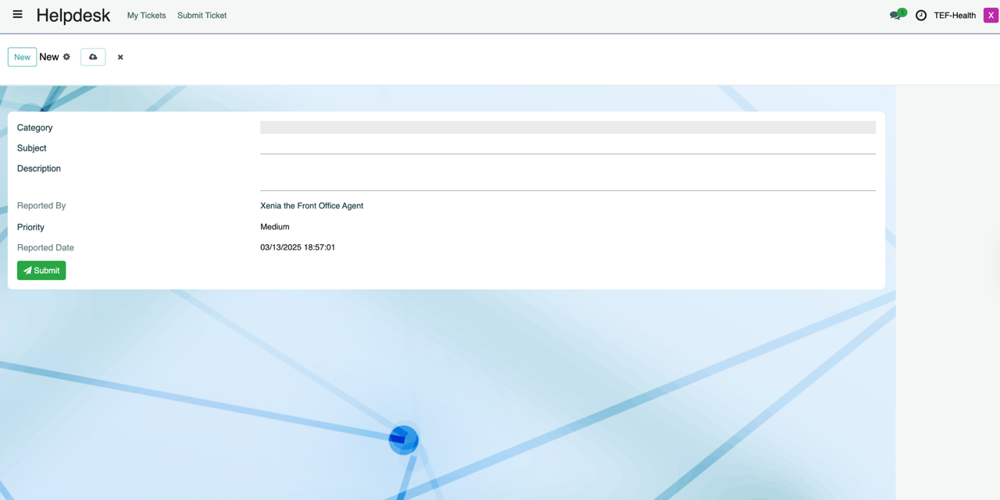
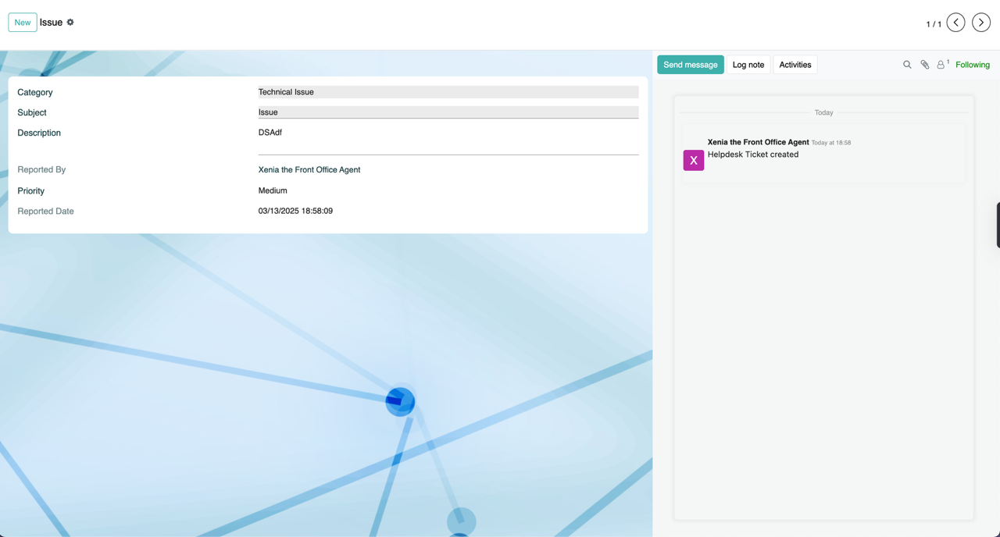
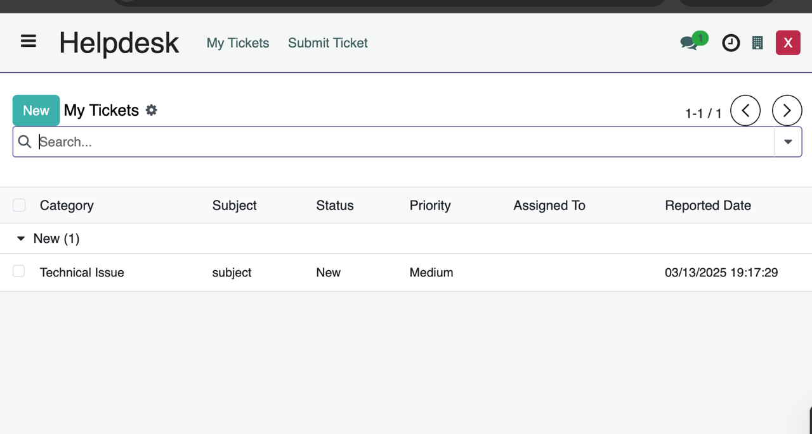
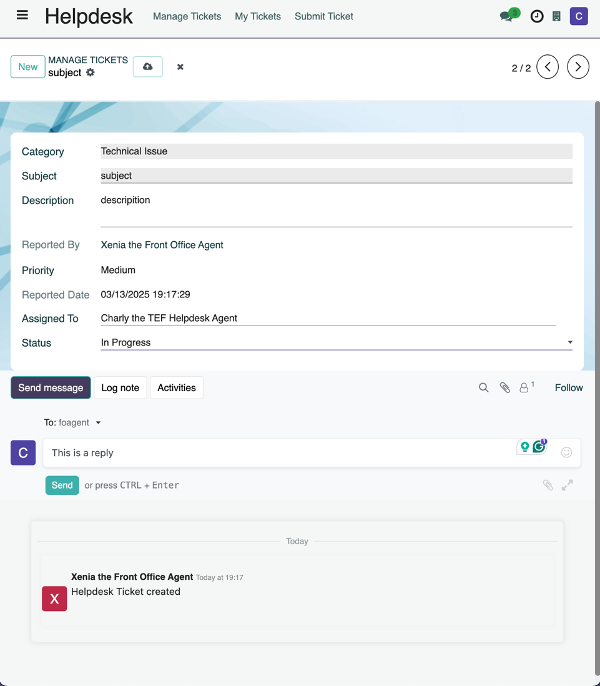

# Helpdesk Guide

Via the **TEF-Health Helpdesk** users open **Support Tickets** and interact with **Helpdesk Agents**. 

## Accessing the TEF Helpdesk
To access the Helpdesk, visit 
[https://tef.charite.de/helpdesk](https://tef.charite.de/helpdesk)

## Submitting a Ticket
1. Navigate to the Helpdesk.  
2. Click on **"New"**.  
3. Fill out the required details:  
    - **Subject** (Brief summary of the issue)  
    - **Description** (Detailed explanation)  
    - **Attachments** (Optional: Upload relevant files/screenshots)  
4. Click **"Submit"** to create the ticket.  
5. A **chatter window** will open where you can communicate with Helpdesk Agents. Users receive notifications when an agent responds.

## Tracking Submitted Tickets
1. Navigate to the Helpdesk.  
2. Click on  **"My Tickets"** to view all your submitted tickets. Tickets are **grouped by stage** (e.g., Open, In Progress, Resolved).
3. Click on a ticket to view details and update it if needed.
4. If the issue is resolved, the ticket will be marked as **Closed**. Users can reopen a ticket if they believe further assistance is needed.

## Helpdesk Agents
Helpdesk Agents  

- **Receive notifications** when a user updates a ticket. 
- **Review submitted tickets**. 
- **Assign tickets** to team members.  
- **Change ticket status** based on progress.  
- **Reply to tickets** via the chatter, triggering notifications.  
- Mark tickets as **Resolved** when an issue is fixed.  
  
  

