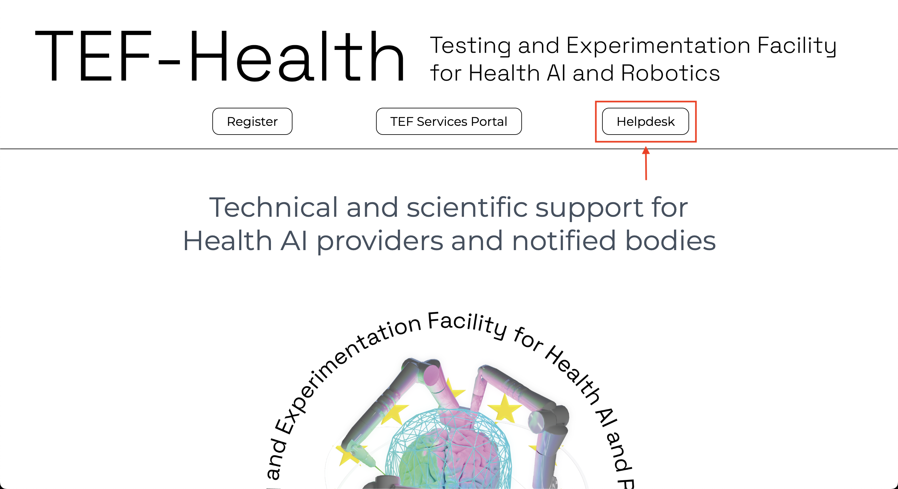
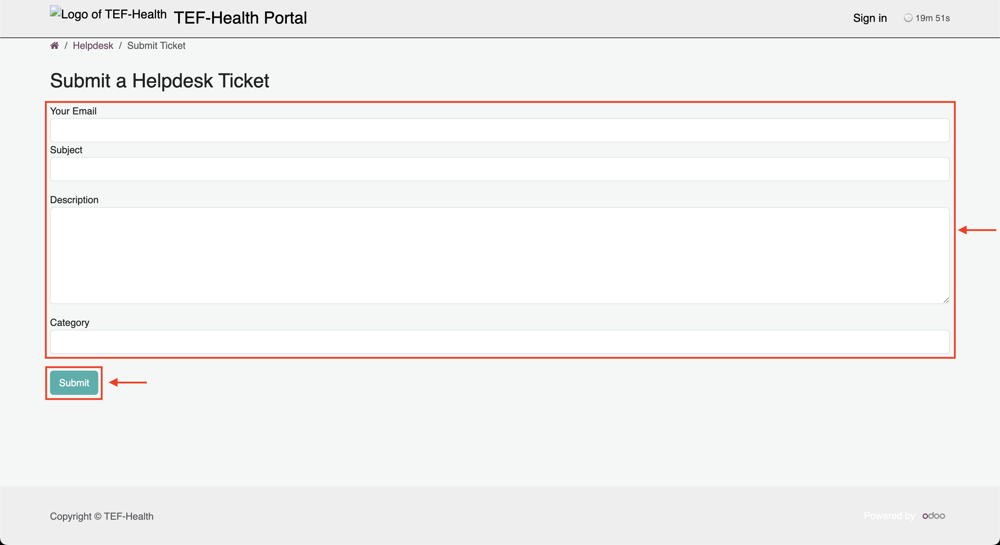
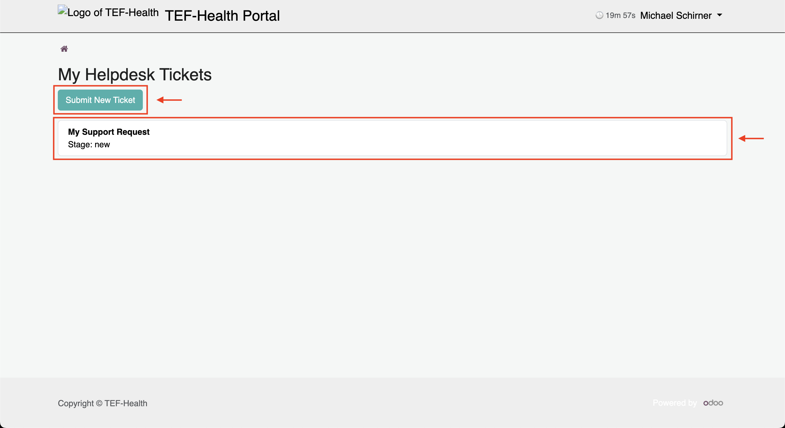
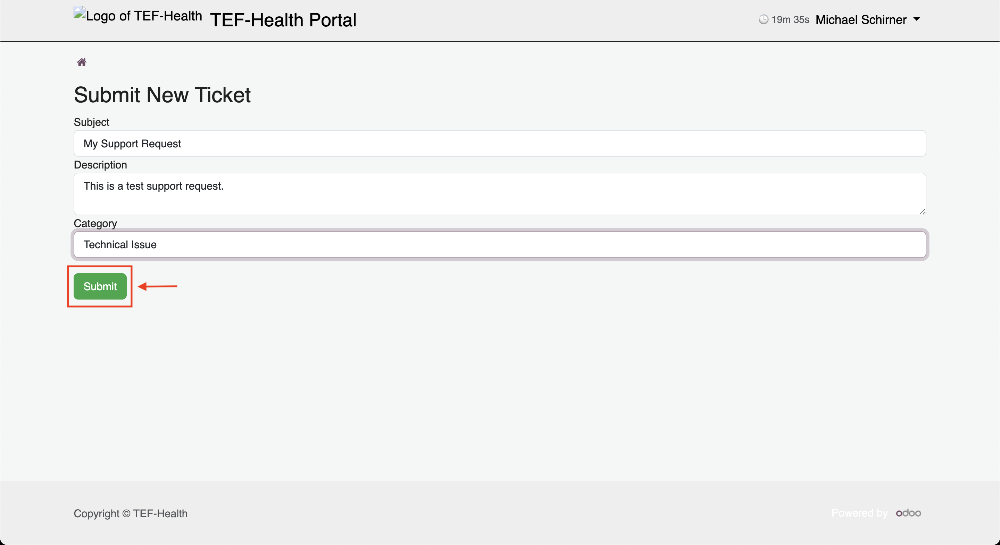
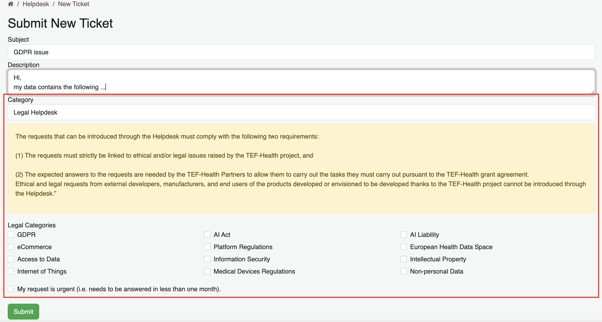
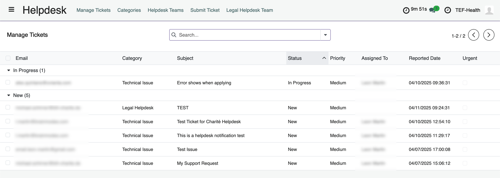
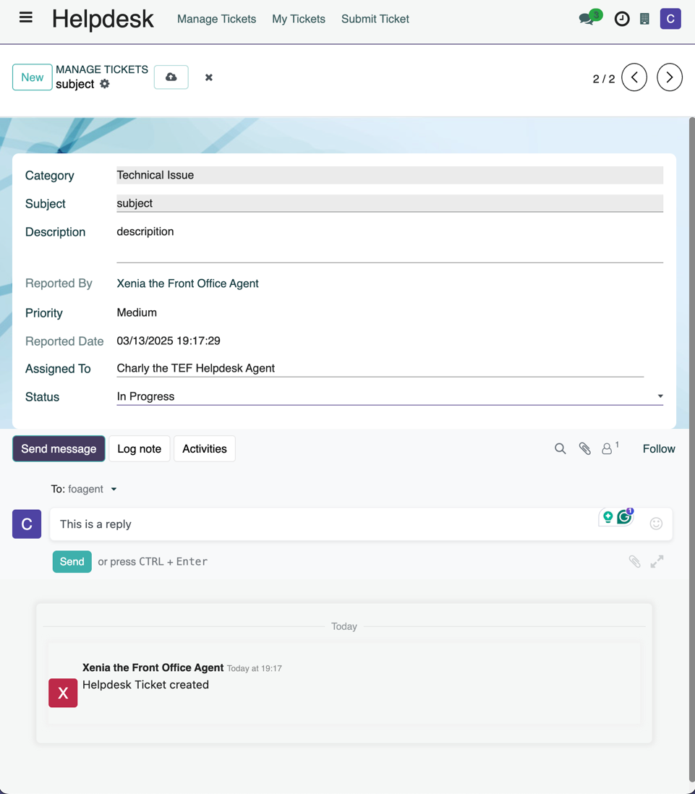
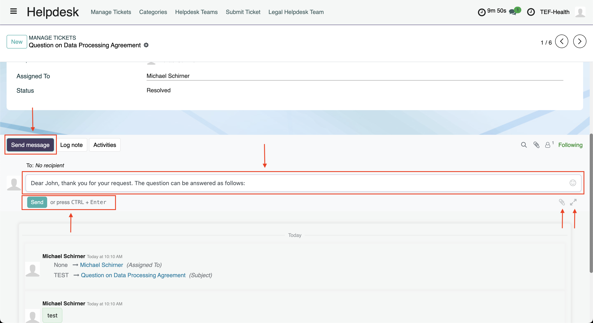
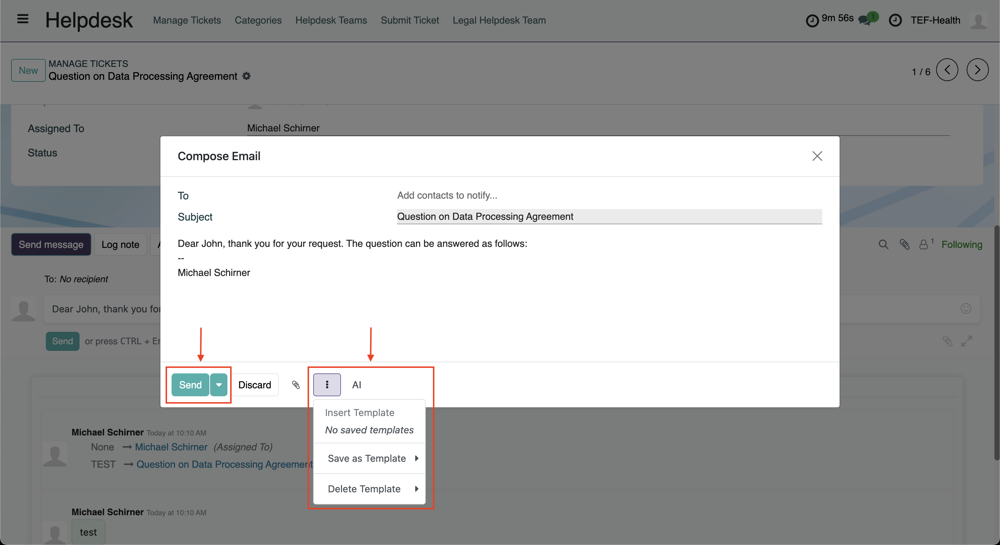

# Helpdesk Guide

Applicants can submit **Support Requests** and interact with **TEF-Health Helpdesk Agents** via the **TEF-Health Helpdesk**.

!!! warning "Confidential Information"
    Please **do not provide confidential information** in Support Requests.

## Accessing the Helpdesk

1. Browse to [https://tef.charite.de/helpdesk](https://tef.charite.de/helpdesk){ target="_blank" }.
2. Alternatively, browse to [https://tef.charite.de](https://tef.charite.de){  target="_blank" } and click on **Helpdesk**. 

## Submitting tickets

### Via Public Helpdesk

Platform visitors without user account can submit support tickets without logging in.
 

1. Browse to [https://tef.charite.de/helpdesk](https://tef.charite.de/helpdesk){ target="_blank" }.
2. Enter your 
    - **E-mail**, 
    - **Subject** of the support request, 
    - **Description** of the problem,
    - **Category** of the request.
3. Click **Submit**. A Helpdesk Agent will contact you via E-Mail.
4. Interact with the Helpdesk Agent by responding to their E-mails.

### Via Portal Helpdesk

If you are logged-in, you can access the internal portal Helpdesk
[https://tef.charite.de/platform/helpdesk](https://tef.charite.de/platform/helpdesk){ target="_blank" }.

1. Upon logging-in, browse to [https://tef.charite.de/helpdesk](https://tef.charite.de/helpdesk){ target="_blank" }. You will be redirected to [https://tef.charite.de/portal/helpdesk](https://tef.charite.de/portal/helpdesk). Both URLs can be used to access the Portal Helpdesk. 
2. Click on the button **Submit New Ticket** to create a new Support Requests. You can see your previous Support Requests underneath the button. 
3. Enter 
    - **Subject** of the support request, 
    - **Description** of the problem,
    - **Category** of the request.
4. Click **Submit**. You will receive a notification when a Helpdesk Agent responded to your request. 
5. In case of requests to the **Legal Helpdesk**, the **Legal Categories** (e.g. GDPR, AI Act, etc.) is specified to guide the request to the respective experts. 

### Via Email

1. Write an email with your request to **helpdesk@tefhealth.eu**.
2. You will receive an email with a link to the new ticket on the TEF-Health Platform.
3. You can reply to responses either via email or via the TEF-Health Platform.

## Viewing support request tickets

1. Navigate to the Helpdesk by clicking on the button **Helpdesk** in the left-hand menu.
2. Click on  **"Manage Tickets"** in the top navigation bar to view all submitted tickets. Tickets are **grouped by stage** (e.g., Open, In Progress, Resolved). 
3. Click on a ticket to view its details. 

## Answering support request tickets

1. Open the ticket.
2. Click on **Send Message**.
3. Insert response text in the text box.
4. Click on **Send** to send the text. Attachments can be added by clicking on the paper clip. 
5. A dedicated overlay allows to schedule the sending of the message: click on the small arrow next to **Send** and then on **Send Later**. 
6. The overlay also allows to save responses as template and re-use them later. Click on the three dots and then **Save as Template** to save a response and **Insert Template** to load a saved response. 
