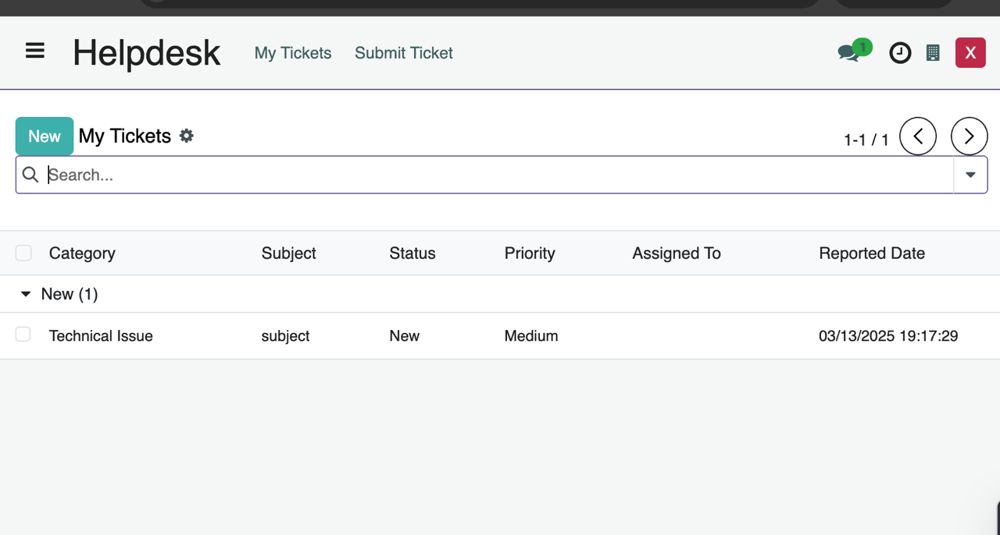
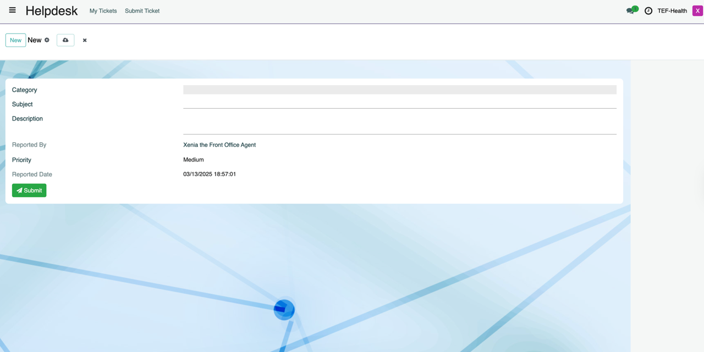
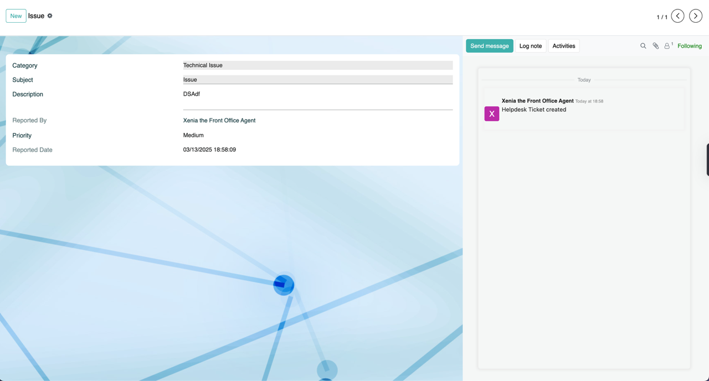

# Helpdesk Guide

Via the **TEF-Health Helpdesk** users submit **Support Requests** and interact with **Helpdesk Agents**. 

## Requesting Support

### Via Public Helpdesk

Platform visitors without user account can submit support tickets without logging in. 

1. To access the public TEF-Health Helpdesk, visit [https://tef.charite.de/helpdesk](https://tef.charite.de/helpdesk).
2. Enter your 
    - **E-mail**, 
    - **Subject** of the support request, 
    - **Description** of the problem,
    - **Category** of the request.
3. Click **Submit**. A Helpdesk Agent will contact you via E-Mail.
4. Interact with the Helpdesk Agent by responding to their E-mails.

### Via Portal Helpdesk

If you are logged-in, you can access the internal portal Helpdesk
[https://tef.charite.de/platform/helpdesk](https://tef.charite.de/platform/helpdesk).

1. Upon logging-in, browse to [https://tef.charite.de/helpdesk](https://tef.charite.de/helpdesk). You will be redirected to [https://tef.charite.de/portal/helpdesk](https://tef.charite.de/portal/helpdesk). Both URLs can be used to access the Portal Helpdesk. 
2. Click on the button **Submit New Ticket** to create a new Support Requests. You can see your previous Support Requests underneath the button. 
3. Enter 
    - **Subject** of the support request, 
    - **Description** of the problem,
    - **Category** of the request.
4. Click **Submit**. You will receive a notification when a Helpdesk Agent responded to your request. 

### Via Email

1. Write an email with your request to **helpdesk@tefhealth.eu**.
2. You will receive an email with a link to the new ticket on the TEF-Health Platform.
3. You can reply to responses either via email or via the TEF-Health Platform.

## Helpdesk Agents
Helpdesk Agents  

- **Receive notifications** when a user updates a ticket. 
- **Review submitted tickets**. 
- **Assign tickets** to team members.  
- **Change ticket status** based on progress.  
- **Reply to tickets** via the chatter, triggering notifications.  
- Mark tickets as **Resolved** when an issue is fixed.  
  
  

### Tracking Submitted Tickets
1. Navigate to the Helpdesk.  
2. Click on  **"My Tickets"** to view all your submitted tickets. Tickets are **grouped by stage** (e.g., Open, In Progress, Resolved).
3. Click on a ticket to view details and update it if needed.
4. If the issue is resolved, the ticket will be marked as **Closed**. Users can reopen a ticket if they believe further assistance is needed.

## Helpdesk Topics (TBD)

### TEF-Health Helpdesk

- Ethics &  Legal
- Calls & Applications
- Certification
- Standards
- TEF general
- TEF Nodes
- Education
- TEF Internal

### CoordinaTEF Helpdesk

### Via TEF-Health Platform (Outdated!)

1. Navigate to the Helpdesk.  
   
2. Click on **"New"**.  
3. Fill out the required details:  
    - **Subject** (Brief summary of the issue)  
    - **Description** (Detailed explanation)  
    - **Attachments** (Optional: Upload relevant files/screenshots)  
4. Click **"Submit"** to create the ticket.  
5. A **chatter window** will open where you can communicate with Helpdesk Agents. Users receive notifications when an agent responds.

