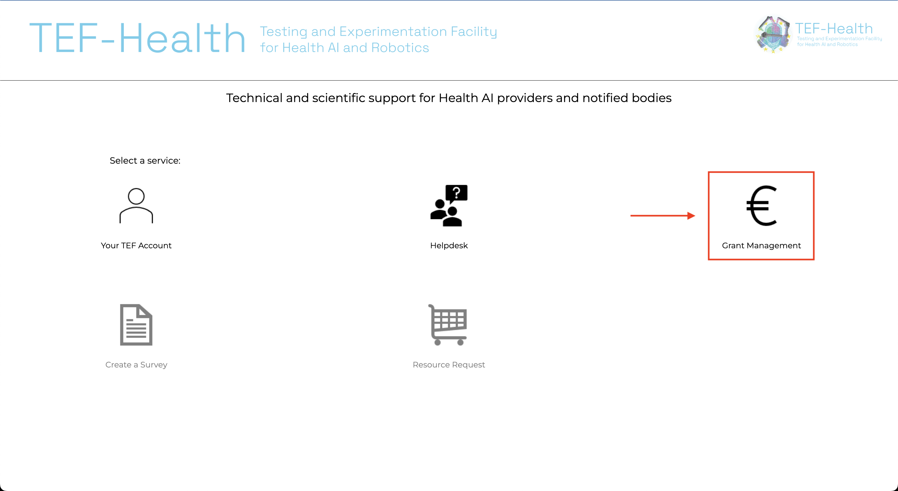
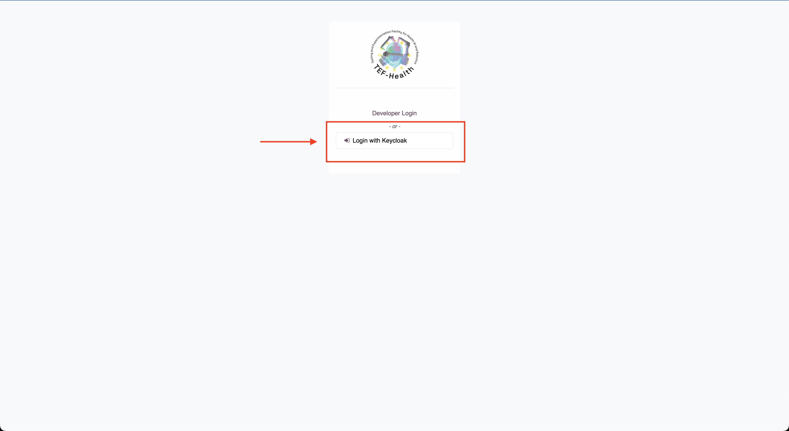

# TEF-Health Call Management Workflow

## New to TEF-Health? 

[Visit tefhealth.eu](https://tefhealth.eu/){: .md-button .md-button--primary target="_blank" }

## Getting Access

- [Creating a User Account](accounts.md) - Create an account on the TEF-Platform with base permissions
- [Requesting Higher Roles](permissions.md) - Request permissions higher than the base role

## Accessing the TEF-Health Call Management Portal

The **Call Management Portal** can be accessed in two ways, via the **TEF-Health Portal Landing Page** or by directly browsing to the **Call Management Landing Page**.

### TEF-Health Portal Landing Page
Browse to [https://tef.charite.de](https://tef.charite.de) and click on **Call Management**.

### Call Management Landing Page
Browse to [https://tef.charite.de/odoo](https://tef.charite.de/odoo) and click on **Login with Keycloak** and enter your account credentials.

## User Roles

Jump to the Documentation of each User Role:

* [Helpdesk](helpdesk.md) - Get Support
* [Applicant](applicant.md) - Apply for Services at reduced prices
* [Service Provider](service-provider.md) - Manage Service Provisions and Catalogue entries
* [Reviewer](reviewer.md) - Review Applications
* [Front Office](front-office.md) - Support for Applications
* [Node Lead](node-lead.md) - Participate in Calls
* [Coordinator](coordinator.md) - Coordinate the project

## Permission matrix

| **Role Permissions**                            | Admin                | Coordinator     | Node Lead      | Front Office Team Lead  | Front Office Agent | Reviewer   | Potential Reviewer | Service Provider| Applicant   | Helpdesk Agent |
| :----------------------------------------------:| :----------------:   | :-----------:   | :---------:    | :----------------------:   | :------------------:  | :--------: | :------------------:  | :----------------: | :---------: |:------------:  |
| Start a Call                                    |       ✅        	 |      ✅      	 |    ❌       	|          ❌             	 |         ❌          	 |     ❌     |          ❌          |        ❌          |     ❌      |                |
| Grant Roles                                     |       ✅        	 |      ✅      	 |    ❌       	|          ❌             	 |         ❌          	 |     ❌     |          ❌          |        ❌          |     ❌      |  ❌            |
| Invite User                                     |       ✅        	 |      ✅      	 |    ❌       	|          ❌             	 |         ❌          	 |     ❌     |          ❌          |        ❌          |     ❌      |  ❌            |
| Invite User to assume Role                      |       ✅        	 |      ✅      	 |    ❌       	|          ❌             	 |         ❌          	 |     ❌     |          ❌          |        ❌          |     ❌      |  ❌            |
| Confirm Service Provision                       |       ✅        	 |      ✅      	 |    ❌       	|          ❌             	 |         ❌          	 |     ❌     |          ❌          |        ❌          |     ❌      |  ❌            |
| Assign Front Office Lead                        |       ✅        	 |      ✅      	 |    ✅       	|          ❌             	 |         ❌          	 |     ❌     |          ❌          |        ❌          |     ❌      |  ❌            |
| Assign Front Office Agent to Front Office Group |       ✅        	 |      ✅      	 |    ✅       	|          ✅             	 |         ❌          	 |     ❌     |          ❌          |        ❌          |     ❌      |  ❌            |
| Assign Front Office Agent to Application        |       ✅        	 |      ✅      	 |    ✅       	|          ✅             	 |         ❌          	 |     ❌     |          ❌          |        ❌          |     ❌      |  ❌            |
| View all Applications (incl. unfinished)        |       ✅        	 |      ✅      	 |    ✅       	|          ✅             	 |         ❌          	 |     ❌     |          ❌          |        ❌          |     ❌      |  ❌            |
| View all Reviews                                |       ✅        	 |      ✅      	 |    ✅       	|          ✅             	 |         ❌          	 |     ❌     |          ❌          |        ❌          |     ❌      |  ❌            |
| Assign Reviewer                                 |       ✅        	 |      ✅      	 |    ✅       	|          ✅             	 |         ✅          	 |     ❌     |          ❌          |        ❌          |     ❌      |  ❌            |
| Reject Application                              |       ✅        	 |      ✅      	 |    ✅       	|          ✅             	 |         ✅          	 |     ✅     |          ❌          |        ❌          |     ❌      |  ❌            |
| View own/assigned application                   |       ✅        	 |      ✅      	 |    ✅       	|          ✅             	 |         ✅          	 |     ✅     |          ❌          |        ✅          |     ✅      |  ❌            |
| Edit own/assigned application                   |       ✅        	 |      ❌      	 |    ❌       	|          ❌             	 |         ❌          	 |     ❌     |          ❌          |        ❌          |     ✅      |  ❌            |
| Add, remove, edit Services in Service Catalogue |       ✅        	 |      ✅      	 |    ❌       	|          ❌             	 |         ❌          	 |     ❌     |          ❌          |        ✅          |     ❌      |  ❌            |
| Approve compliance with (national) funding rules|       ✅        	 |      ❌      	 |    ✅       	|          ❌             	 |         ❌          	 |     ❌     |          ❌          |        ❌          |     ❌      |  ❌            |
| View all Helpdesk Tickets                       |       ✅        	 |      ✅      	 |    ❌       	|          ❌             	 |         ❌          	 |     ❌     |          ❌          |        ❌          |     ❌      |  ✅            |
| Assign Helpdesk Agents to Helpdesk Tickets      |       ✅        	 |      ✅      	 |    ❌       	|          ❌             	 |         ❌          	 |     ❌     |          ❌          |        ❌          |     ❌      |  ✅            |
| Respond to Helpdesk Tickets                     |       ✅        	 |      ✅      	 |    ❌       	|          ❌             	 |         ❌          	 |     ❌     |          ❌          |        ❌          |     ❌      |  ✅            |

## Notifications

The following notification types are configured for each user role.

- 🔔 Call to Action  
- ✅ Confirmation  
- ℹ️ Information  
- ❌ None  

|  | Coordinator | Node Lead | Front Office Lead | Front Office Agent | Applicant | Reviewer |
|:---:|:---:|:---:|:---:|:---:|:---:|:---:|
| Application submitted to **Front Office Lead** | ℹ️ | 🔔 | 🔔 | ❌ | ✅ | ❌ |
| Application submitted to **Front Office Agent** | ℹ️ | ℹ️ | 🔔 | ✅ | ❌ | ❌ |
| Application submitted to **Reviewers** | ℹ️ | ℹ️ | ℹ️ | ✅ | ✅  | 🔔 |

## Modules

* [Service Catalogue](service-catalogue.md) - TEF-Health Service Catalogue