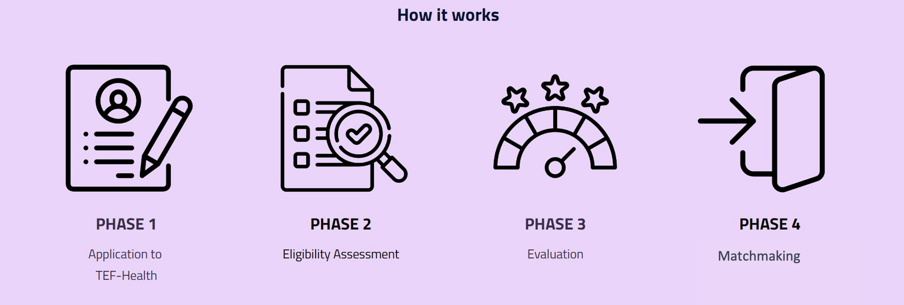

# Call Process

1. Startups and SMEs apply for price reductions on TEF-Health Services via the TEF-Health Platform at [https://tef.charite.de](https://tef.charite.de). 
2. Applicants confirm they fulfill eligibility criteria (eligibility criteria and full information on [Call 1](https://tef.charite.de/docs/call/call1/) and [Call 2](https://tef.charite.de/docs/call/call2/)). 
3. Independent reviewers evaluate and score Applications.  
4. Applicants negotiate the terms of the Service Provisioning with the Service Providers.
