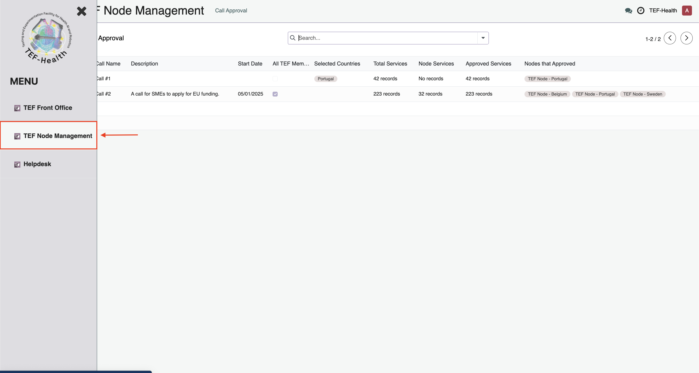

# Node Lead Guide

**Node Leads review and approve new Calls** created by the Coordinator, confirming that applications are handled by the applicant's country's Node. Some Nodes (e.g., the Swedish Node) may cover additional countries (such as Norway). Node Leads must confirm that the Call will run in their country (or countries), select the Service(s) from their Node that will participate, and verify compliance with national and EU regulations. In addition to confirming calls, Node Leads assign Front Office Leads to National Front Office Groups (grouped by Node and Call) for managing the applications.

!!! warning "Signed Joint Controllership Agreement"
    The processing of personal data can only commence after the Joint Controllership Agreement has been signed, both in physical and digital formats.

## Node Management Dashboard  

- The **Node Management Dashboard** is accessible via the lefthand menu button **TEF Node Management**   
- It provides a list of all current and upcoming **Calls**. The list indicates the time period of each call, the country coverage (selected countries vs. all EU TEF-Health partner countries), the total number of services offered by the Node, and the number of services selected to participate in the Call.

## Reviewing and Approving Call Participation

- **Node Leads receive notifications** when a new Call Draft was created by the Coordinator.  
- To **review and update** Call Details, Node Leads **click on a call entry** on the Dashboard.  
- In the Call Details View, Node Leads are presented with a list of Services that have been approved by Service Providers to participate in the Call.  
- Node Leads **select all Services** from their Node that they approve to participate in the Call from the list. Node Leads must approve the inclusion of Services (previously approved by the Service Providers) into the Call.
- Node Leads confirm Call participation by clicking "**I agree that services of the node I am representing are included in the selected call**". Node Leads receive a confirmation email that their Node participates in the Call.

## National Front Offices

### Forming National Front Office Groups

TBD

- **Group Formation:**  
  Calls are grouped by Node and Call, creating National Front Office Groups (e.g., Sweden-Call#2, Sweden-Call#3, ...).

### Assigning Front Office Leads

TBD

- **Assignment Process:**   
    - Assign Front Office Leads to each group directly from the Call Details interface.
    - Front Office Leads are responsible for further assigning Front Office Agents to groups and to new applications.
    

## Compliance Verification

### Verifying National State Aid Rules
- **State Aid Compliance:**  
  Verify that the new Call Draft reflects the correct National Rules for State Aid, including:
    - **GBER vs. de minimis:** Ensure that de minimis conditions apply only when incorporated in the member state of the Service Provider.
    - **SME Compliance:** Confirm that definitions of SME according to EU standards are met.
    - **Financial Thresholds:** Check that self-declaration limits (e.g., < €300k in the last 3 financial years) are correctly stated.
    - **Technology Readiness Levels:** Validate the stated start TRL and target TRL, and that audits of Service Pricing are planned.

### Ensuring Co-Funding Requirements
- **Logo & Branding Compliance:**  
  Ensure that all required logos and branding elements are present as per co-funding guidelines.

### Approving Contract Clause Templates
- **Contract Templates:**  
  Approve or update the templates for clauses to be included in contracts with national Service Providers, such as the acknowledgment of State Aid support.

