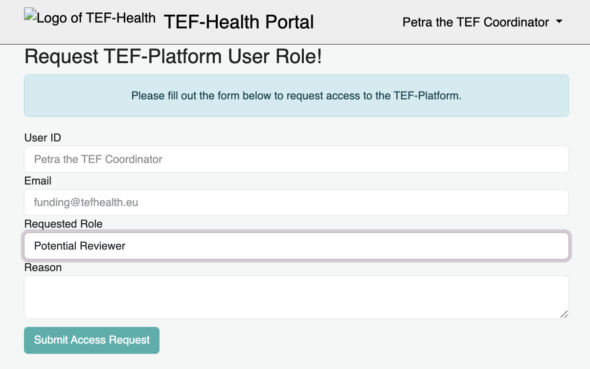
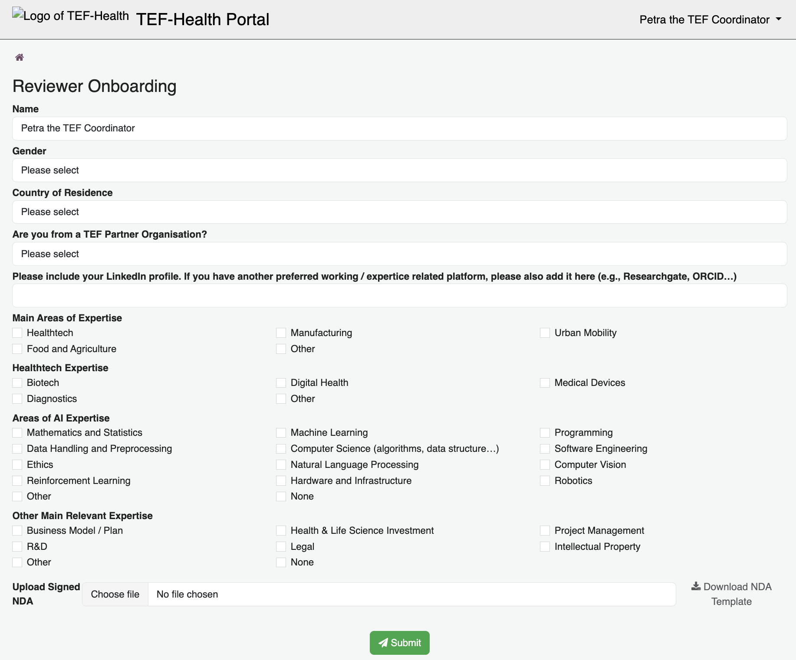
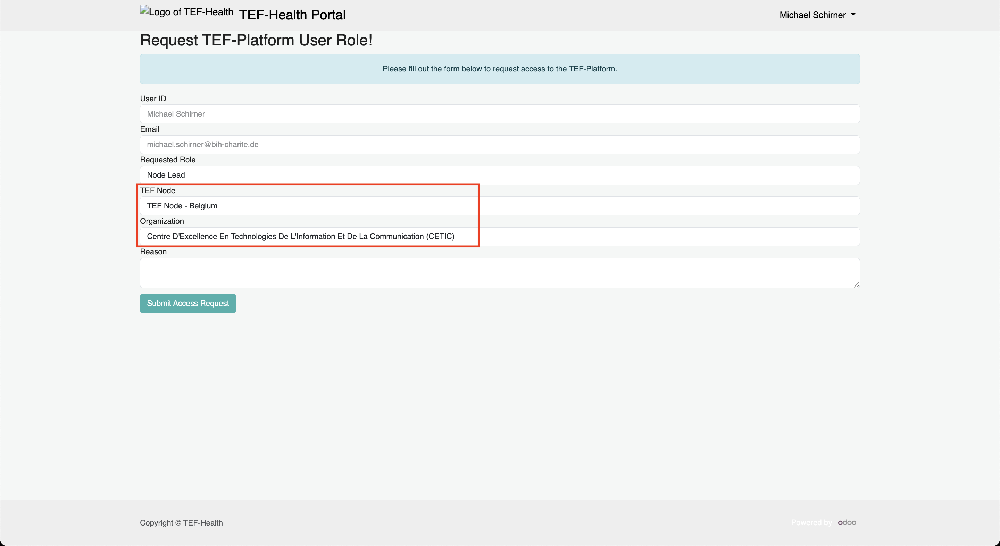
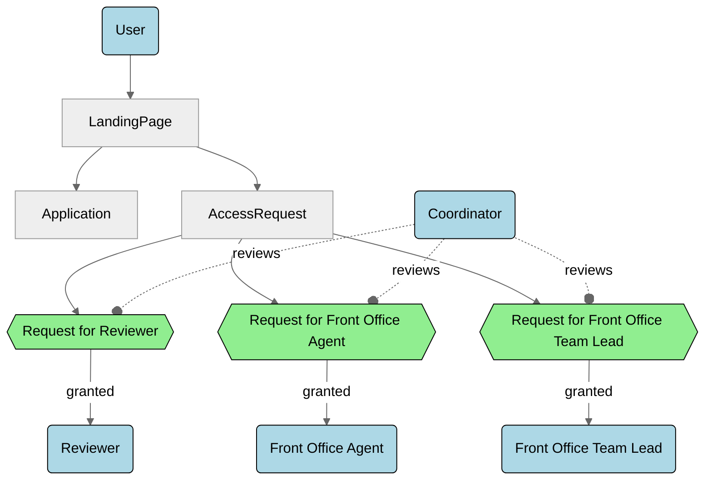

# Requesting Higher Roles

Users can request **additional permissions** beyond the base Applicant role. Users may either **self-request a higher role or be invited**. In both cases, specific additional information is required, which is then reviewed.

!!! warning "Signed Joint Controllership Agreement"
    Roles that involve the processing of personal data by TEF-Health Consortium Partners are only granted after the Joint Controllership Agreement has been signed by the corresponding Partner, both in physical and digital formats.
    
!!! info "Quickstart"
    Browse to [https://tef.charite.de/portal/access-request](https://tef.charite.de/portal/access-request) and complete the form. In certain cases, you may receive invitations to upgrade your role by an authorized user. Follow the steps in the invitation email to assume the higher role.

## Step by step

### Step 1: **Submit Access Request Form**  

Open [https://tef.charite.de/portal/access-request](https://tef.charite.de/portal/access-request). If you are being redirected to a login page, please log in using your credentials before continuing to the site. Enter your User ID, your Email, select the needed role, and provide a short Reason why the access is needed. Click on **Submit Access Request**. You will receive an email with further instructions, depending on the chosen role.

   
### Step 2: **Complete the onboarding for the chosen role**   

Depending on the role you are requesting, you will need to perform the following steps. 
   
=== "Reviewer"
    Reviewers must undergo the **Reviewer Onboarding** on the page [https://tef.charite.de/portal/reviewer/onboarding](https://tef.charite.de/portal/reviewer/onboarding). Complete the required form by providing the following information:

    - **Areas of Expertise:** Select your area(s) of expertise from a predefined choice list. This information helps the Front Office assign you to the appropriate applications.
    - **Reviewer Contract:** Download and sign the Reviewer contract, which includes a **Non-Disclosure Agreement** (NDA). Either sign the document with a wet signature and scan the signed page, or provide a digital signature with valid certificate chain.
    - **Consent to Code of Conduct:** Read and agree to the TEF-Health Code of Conduct by checking the provided box.
    - **Consent to Working Arrangements:** Confirm that you accept the defined working arrangements (e.g., collaboration practices, timelines) by checking the appropriate box.
    - **Consent for Entry in the TEF-Health Reviewer Database:** Agree to have your details stored in the reviewer database for assignment and record-keeping purposes.
    
    
=== "Service Provider"
    To request this role, provide the following information  
    1. TEF Node  
    2. Organization  
    
=== "Funder"
    To request this role, provide the following information  
    1. TEF Node  
    2. Organization 
     
=== "Front Desk Agent"
    To request this role, provide the following information  
    1. TEF Node  
    2. Organization	  
    
   
### Step 3: **Wait for approval**   
   All role requests (self-submitted or via invitation) are reviewed by the Coordinator. Once reviewed, you will be notified whether your request is approved or if further information is required. 
   
   
## Dependency Diagram

