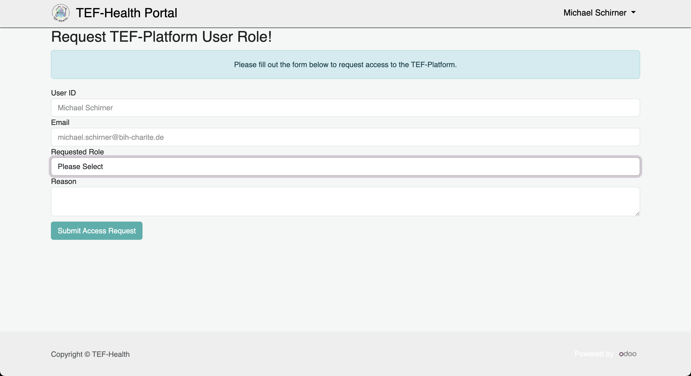
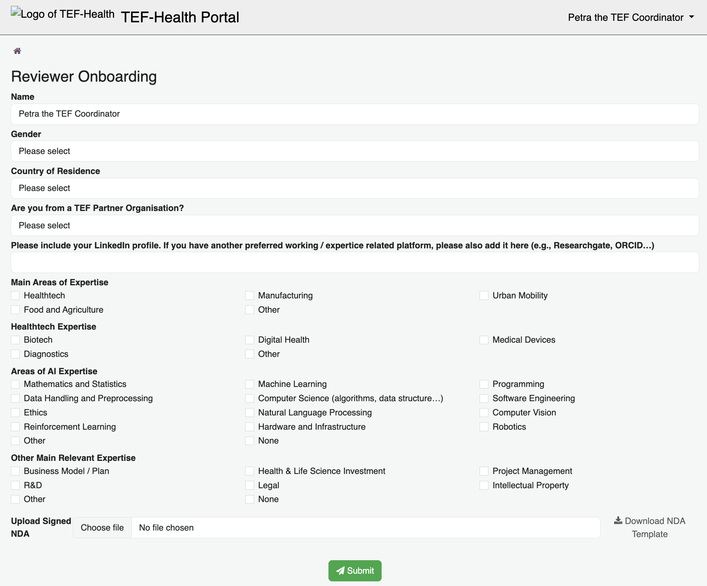
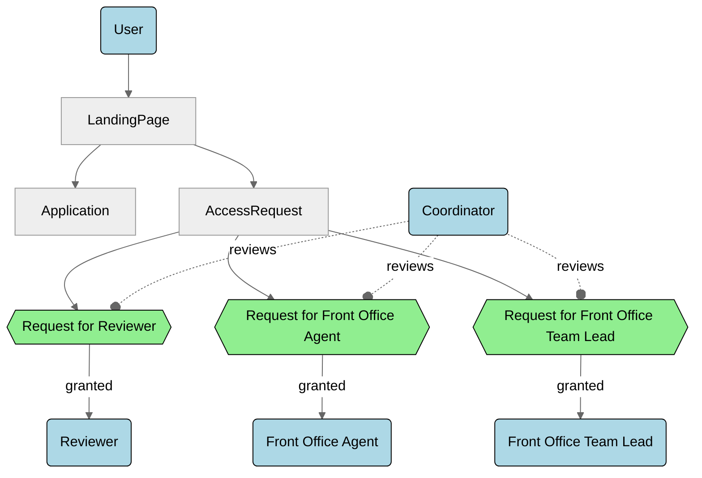

# Requesting Higher Roles

Users can request **additional permissions** beyond the base Applicant role. Users may either **self-request a higher role or be invited**. In both cases, specific additional information is required, which is then reviewed.

!!! warning "Signed Joint Controllership Agreement"
    Roles that involve the processing of personal data by TEF-Health Consortium Partners are only granted after the Joint Controllership Agreement has been signed by the corresponding Partner, both in physical and digital formats.
    
!!! info "Quickstart (Helpdesk, Front Office and Node Staff)"
    Browse to [https://tef.charite.de/portal/access-request](https://tef.charite.de/portal/access-request) and complete the form. In certain cases, you may receive invitations to upgrade your role by an authorized user. Follow the steps in the invitation email to assume the higher role.
    
!!! info "Quickstart (Reviewers)"
    Reviewers undergo a dedicated onboarding procedure. Browse to [https://tef.charite.de/portal/reviewer/onboarding](https://tef.charite.de/portal/reviewer/onboarding) and complete the form.

## Step by step (Helpdesk, Front Office and Node Staff)

### Step 1: Browse to Permission Request Page

Open [https://tef.charite.de/portal/access-request](https://tef.charite.de/portal/access-request). If you are being redirected to the login page, please log in using your credentials before continuing to the site. 

### Step 2: Select role

Select the needed role, and provide a short reason why the access is needed. Click on **Submit Access Request**. You will receive an email with further instructions, depending on the chosen role.

### Step 3: **Wait for approval**   
All role requests (self-submitted or via invitation) are reviewed by the Coordinator. Once reviewed, you will be notified whether your request is approved or if further information is required. 

## Step by step (Reviewers)

### Step 1: Browse to Reviewer Onboarding Page

Reviewers must undergo the **Reviewer Onboarding** on the page [https://tef.charite.de/portal/reviewer/onboarding](https://tef.charite.de/portal/reviewer/onboarding). 

### Step 2: Complete Onboarding Form

Complete the required form by providing the following information:

- Name, Country, LinkednIn Profile, TEF Partner Organization
- **Areas of Expertise:** Select your area(s) of expertise from a predefined choice list. This information helps the Front Office assign you to the appropriate applications.
- **Reviewer Contract:** Download and sign the Reviewer contract, which includes a **Non-Disclosure Agreement** (NDA). Either sign the document with a wet signature and scan the signed page, or provide a digital signature with valid certificate chain. 

Click on **Submit** to submit the form.

### Step 3: **Wait for approval**   
All role requests (self-submitted or via invitation) are reviewed by the Coordinator. Once reviewed, you will be notified whether your request is approved or if further information is required. 
   
## Dependency Diagram

``` mermaid 
%%{init: {'theme': 'neutral'}}%%

graph TD
    classDef userStyle fill:#add8e6,stroke:#000,stroke-width:1px;
    classDef requestStyle fill:#90ee90,stroke:#000,stroke-width:1px;
    classDef attrStyle fill:#ffffe0,stroke:#000,stroke-width:1px;
    classDef docStyle fill:#ffcc99,stroke:#000,stroke-width:1px;

    user(User):::userStyle --> LandingPage
    LandingPage --> Application
    LandingPage --> AccessRequest
    AccessRequest --> rq_reviewer{{Request for Reviewer}}:::requestStyle
    AccessRequest --> rq_foagent{{Request for Front Office Agent}}:::requestStyle
    AccessRequest --> rq_folead{{Request for Front Office Team Lead}}:::requestStyle

    Coordinator(Coordinator):::userStyle -.-o|reviews| rq_folead
    rq_folead -->|granted| folead(Front Office Team Lead):::userStyle

    Coordinator -.-o|reviews| rq_foagent
    rq_foagent -->|granted| foagent(Front Office Agent):::userStyle

    Coordinator -.-o|reviews| rq_reviewer
    rq_reviewer -->|granted| reviewer(Reviewer):::userStyle

```