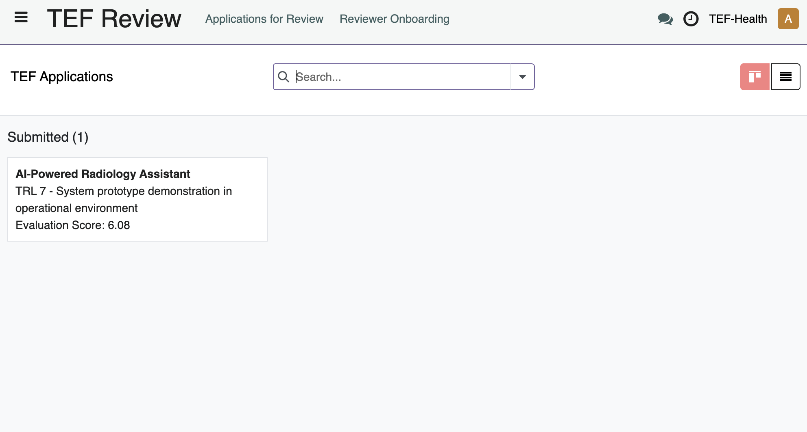
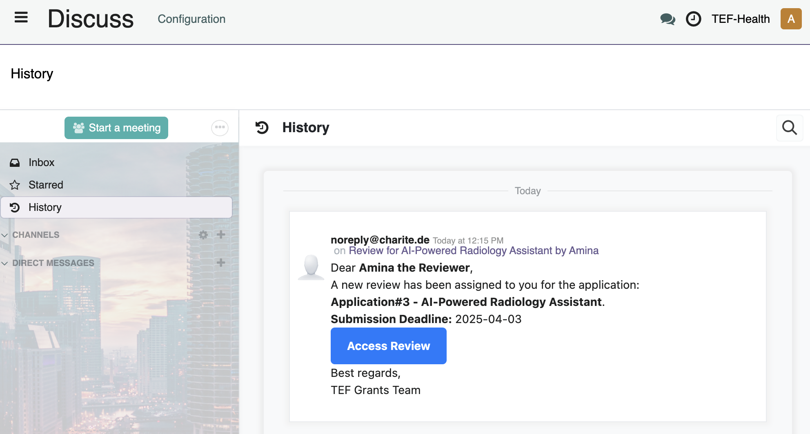
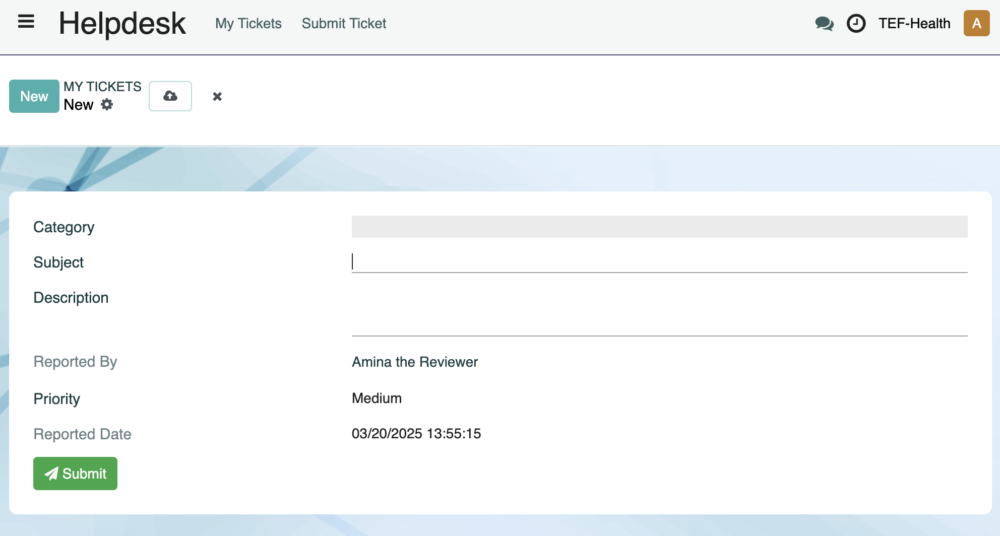

# Reviewer Guide

Reviewers **score Applications** based on predefined criteria.

!!! tip "Key aspect"
    **Note:** Reviewers only assess the quality of the AI solution and its fit to TEF-Health. Eligibility criteria (e.g., to receive State Aid support) need to be confirmed by the Applicant in order to create the Application and are not subject to further review by TEF-Health.

## Reviewer Onboarding and Permissions

To become a Reviewer, please complete the following steps:

- [**Create a User Account**](accounts.md) and then  
- [**Fill out the reviewer onboarding form**](https://tef.charite.de/portal/reviewer/onboarding)).
    * Select your key expertise from the provided choice list. This will help Front Office agents assign you to relevant applications.
    * Sign the Reviewer Onboarding Form / Universal Expert Contract, including an NDA.
    * Consent to the Code of Conduct.
    * Consent to the working arrangements.
    * Consent to your entry in the TEF-Health Reviewer Database.

!!! note "Onboarding Completion"
    Only after the contract is signed by a Charité legal representative, you are added to the **Reviewers Database**. While the request is pending, the user will get the Role **Potential Reviewer**.

## Reviewer View

The Reviewer View is divided into three main dashboards accessible via the left-hand menu:

=== "TEF-Review"
    View all assigned review forms in a Kanban board or list view.  
    

=== "Discuss"
    View email notifications and message history.  
    

=== "Helpdesk"
    Access to the [Helpdesk](helpdesk.md) .
    

## Review Process

### Assignment and Notifications

Reviewers are assigned Applications by Front Office Agents and kept informed through a series of notifications:

| **Notification**             | **Event**                                                   |
|------------------------------|-------------------------------------------------------------|
| **Assignment Notification** | When assigned to a new Application by a Front Office Agent. |
| **Pending Review Reminder** | Alerts for pending reviews.                                 |
| **Deadline Approaching**    | Notifications when the review deadline is near.             |
| **Deadline Passed**         | Follow-up alerts if the review is overdue.                  |

These notifications appear in the top-right header panel of the platform and are also sent via email to the Reviewer.

### Access Review

There are four ways for a Reviewer to access an assigned **Review Form**:

| **Location**                | **Link to Review Form**                         |
|-----------------------------|-------------------------------------------------|
| Reviewer   email inbox      | **Access Review** button                        |
| Reviewer   Discuss module   | **Access Review** button                        |
| Reviewer View               | **Speech Bubble** Icon (top-right header panel) |
| Review Form                 | **TEF-Review Dashboard** (left-hand menu)       |

### Review and Score

- Each Application is linked to a **Reviewer Form** that displays a reduced view of the Application, with confidential information removed.  
- The Reviewer Form can also be used for communication with Front Office Agents.  

- Reviewers scroll the Review Form from top to bottom and browse its tabs from left to right in order to provide a score for each criterion or to enter text comments.  
- Reviewers evaluate the application based on criteria such as Solution Description, Alignment with TEF-Health, and Funding and Financial. Each criterion is scored using a scale of 1 to 7 (excluding 4).

### Save and Submit or Retract

Reviewers can use buttons and checkboxes to manage the Application:

| **Button / Checkbox**    | **Function**                                                                                                                                                                         |
|--------------------------|--------------------------------------------------------------------------------------------------------------------------------------------------------------------------------------|
| **Save Review**          | To save progress and complete the review later.                                                                                                                                      |
| **Retract Review**       | To post-hoc retract a review that has been submitted to the Front Office.                                                                                                            |
| **Conflict of Interest** | Declare a conflict of interest, abort the review and notify the Front Office Agent. A final checkbox confirms that no conflicts of interest emerged during the course of the Review. |
| **Return Review**        | Becomes clickable only when all required fields are completed.                                                                                                                       |

Once the review is completed:

- **Review Submission:**
    - Ensure all fields are completed; only then does the **Return Review** button activate.
    - Submit your review to be recorded in the TEF-Health system.

- **Post-Review Process:**
    - After two reviews have been submitted and if the standard deviation of scores is below 4, the relevant Service Provider(s) are automatically notified of the Service Provision Request. 
    - In case the Standard Deviation of both reviews is larger than 4, indicating a mismatch between the two reviews, a third reviewer will be invited to resolve the ambiguity.

## Conflict of Interest Management

To maintain integrity, Reviewers must manage conflicts of interest proactively:

- **Declining a Review Request:**  
  If you identify a conflict of interest, you may decline the review request immediately.
  
- **During the Review Process:**  
  Use the **Declare Conflict of Interest** button to abort the review. This action notifies the Front Office Agent.

- **Final Declaration:**  
  Before submission, confirm via a checkbox that no conflict of interest became apparent during review.

!!! warning "Conflict of Interest"
    Declaring a conflict of interest is mandatory if any bias is identified. This measure protects both the review process and the Applicant's integrity.

## Communication

Communication between Reviewers and Front Office Agents to address queries regarding review assignments or technical issues can be performed in two ways:

- **Chatter**  
    - Located at the bottom of each review record.  
    - Enables direct communication with the Front Office Agents that assigned the Reviewer to the Application.  
  
- **Discuss** 
    - The entire communication history including email notifications and message history can also be accessed and replied to via the Discuss Module (left-hand menu).
