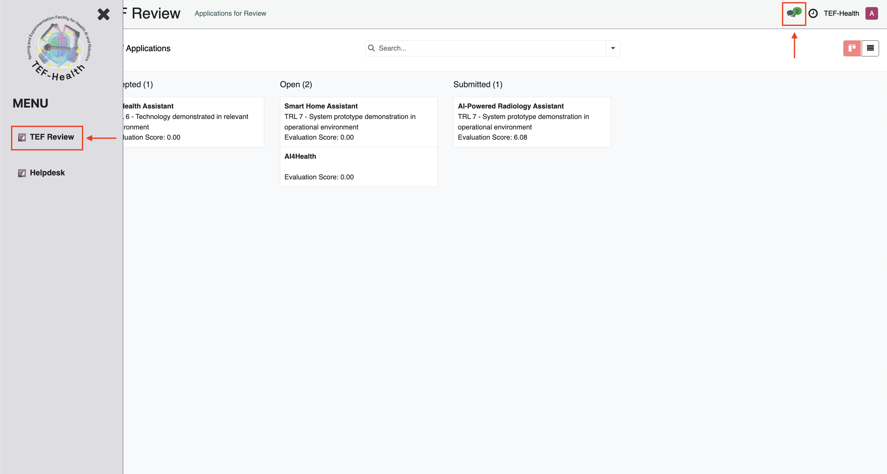
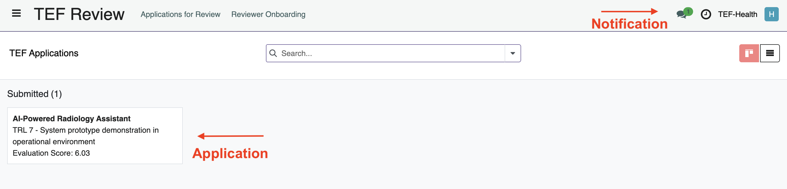
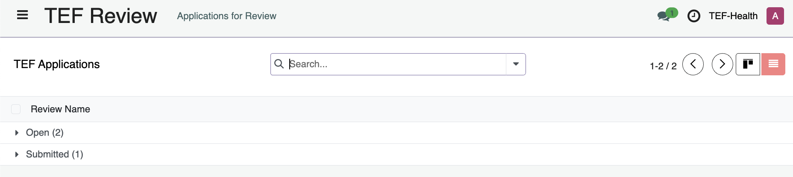
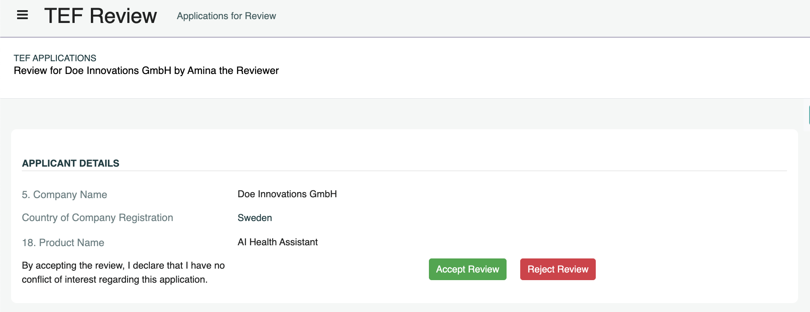
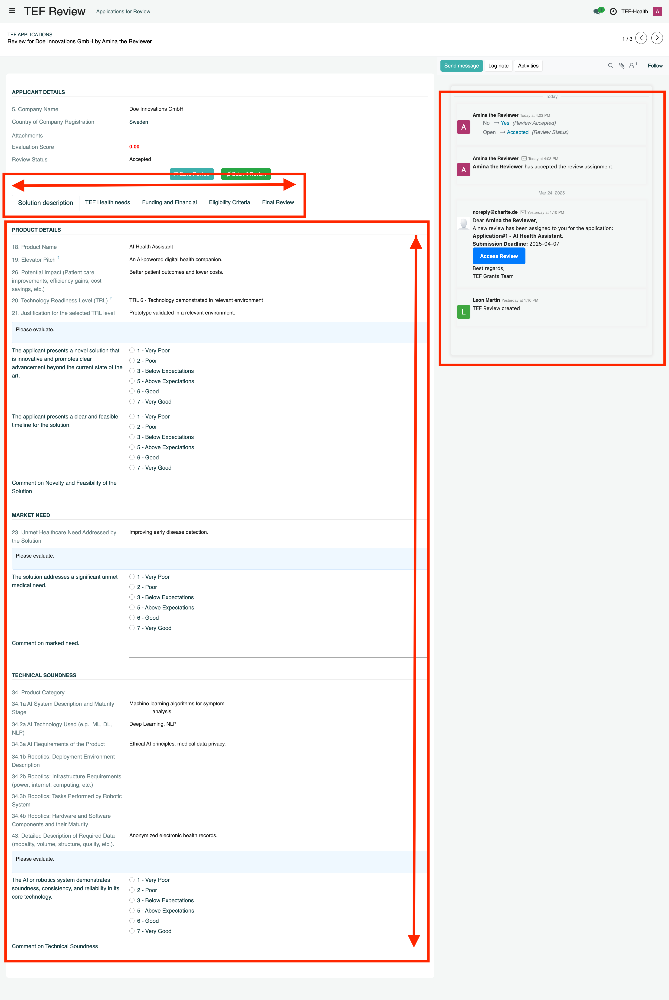
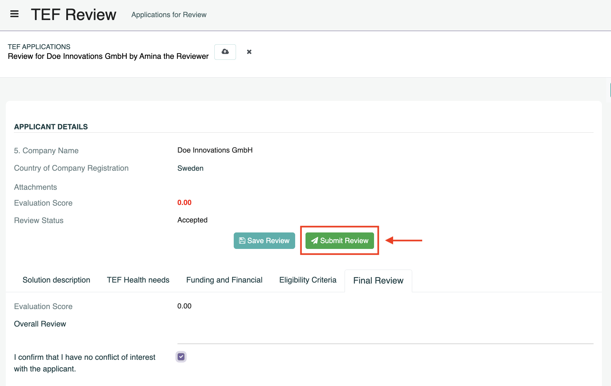

# Reviewer Guide

Reviewers **score Applications** based on predefined criteria.

!!! tip "Key aspect of review"
    **Note:** Reviewers only assess the quality of the AI solution and its fit to TEF-Health. Eligibility criteria (e.g., to receive State Aid support) need to be confirmed by the Applicant in order to create the Application and are not subject to further review by TEF-Health.

## Introduction and Scope

**Dear Reviewer**,

Welcome to the TEF-Health Independent Review Board. TEF-Health is dedicated to accelerating the market entry of AI-driven healthcare solutions by providing comprehensive testing and validation services across the EU. As a reviewer, your role is essential in ensuring a fair and transparent selection process.

You will evaluate each application based on three key criteria: (1) its novelty and potential to advance the state of the art, (2) its ability to address significant unmet medical needs, and (3) its alignment with the service offerings of TEF-Health. For each aspect, you will provide a score along with a concise verbal summary (up to 250 words) justifying your evaluation.

Your assessments will directly influence which SMEs gain access to these valuable services, shaping the future of AI in healthcare across Europe. Each review is expected to take approximately 30 minutes, with up to 10 applications to be assessed within a 10-day to two-week timeframe. Please follow the provided evaluation template and ensure that you declare any potential conflicts of interest before reviewing an application.

Thank you for contributing your expertise to this important initiative.

## Reviewer Onboarding and Permissions

To become a Reviewer, follow the steps outlined under **Getting Started**: 

- [**Create a User Account**](accounts.md)  
- [**Request the Potential Reviewer Role**](permissions.md)
- [**Complete the Reviewer Onboarding**](permissions.md#reviewer).

!!! note "Onboarding Completion"
    Only after the contract is signed by a Charité legal representative, the user is added to the **Reviewers Database**. While the request is pending, the user will get the role **Potential Reviewer**.

## Review Process

### Assignment and Notifications

Reviewers are assigned Applications by Front Office Agents and kept informed through a series of notifications:

| **Notification**             | **Event**                                                   |
|------------------------------|-------------------------------------------------------------|
| **Assignment Notification** | When assigned to a new Application by a Front Office Agent. |
| **Pending Review Reminder** | Alerts for pending reviews.                                 |
| **Deadline Approaching**    | Notifications when the review deadline is near.             |
| **Deadline Passed**         | Follow-up alerts if the review is overdue.                  |

These notifications appear in the top-right header panel of the platform and are also sent via email to the Reviewer.

### Access Review

Applications can be accessed by clicking on the link in the notification email or speech bubble. Alternatively, an overview over all assigned Applications can be accessed from the left-hand menu **TEF Review**.

The Reviewer Dashboard consists of a Kanban board that shows Applications in their different stages. The **Open** column indicates applications that still need to be reviewed, while the **Submitted** column shows Applications that have already been reviewed and submitted back to the Front Office.

In addition to the Kanban View a List View is available. Toggle between Kanban and List view with the buttons on the right near the top of the page.

### Accept Review

To maintain integrity, Reviewers must declare conflicts of interest. Declaring a conflict of interest notifies the Front Office Agent to remove the Reviewer from the assignment and assign the Application to another Reviewer.

- **Accept or decline a Review Request:**  
  If you identify a conflict of interest upon opening an application, you may decline the review request immediately by clicking on **Reject Review**. If you do not perceive a conflict of interest at this time click on **Accept Review**. 
  
- **During the Review Process:**  
  Use the **Declare Conflict of Interest** button to abort the review.

- **Final Declaration:**  
  Before submission, confirm via a checkbox that no conflict of interest became apparent during review. 

!!! warning "Conflict of Interest"
    Declaring a conflict of interest is mandatory if any bias is identified. This measure protects both the review process and the Applicant's integrity.

### Review and Score

- Each Application is linked to a **Reviewer Form** that displays a reduced view of the Application, with confidential information removed.  
- The Reviewer Form can also be used for communication with Front Office Agents.  

- Reviewers scroll the Review Form from top to bottom and browse its tabs from left to right in order to provide a score for each criterion or to enter text comments.  
- Reviewers evaluate the application based on criteria such as Solution Description, Alignment with TEF-Health, and Funding and Financial. Each criterion is scored using a scale of 1 to 7 (excluding 4).

### Save and Submit or Retract

Reviewers can use buttons and checkboxes to manage the Application:

| **Button / Checkbox**    | **Function**                                                                                                                                                                         |
|--------------------------|--------------------------------------------------------------------------------------------------------------------------------------------------------------------------------------|
| **Save Review**          | To save progress and complete the review later.                                                                                                                                      |
| **Retract Review**       | To post-hoc retract a review that has been submitted to the Front Office.                                                                                                            |
| **Conflict of Interest** | Declare a conflict of interest, abort the review and notify the Front Office Agent. A final checkbox confirms that no conflicts of interest emerged during the course of the Review. |
| **Submit Review**        | Becomes clickable only when all required fields are completed.                                                                                                                       |

Once the review is completed:

- **Review Submission:**
    - Ensure all fields are completed; only then does the **Submit Review** button activate.
    - Submit your review to be recorded in the TEF-Health system. 
- **Post-Review Process:**
    - After two reviews have been submitted and if the standard deviation of scores is below 4, the relevant Service Provider(s) are automatically notified of the Service Provision Request. 
    - In case the Standard Deviation of both reviews is larger than 4, indicating a mismatch between the two reviews, a third reviewer will be invited to resolve the ambiguity.

## Communication

Communication between Reviewers and Front Office Agents to address queries regarding review assignments or technical issues can be performed in two ways:

- **Chatter**  
    - Located at the bottom or right-hand side of each review record.  
    - Enables direct communication with the Front Office Agents that assigned the Reviewer to the Application.  
    - The entire communication history including email notifications and message history can be accessed and replied to via the Chatter.
