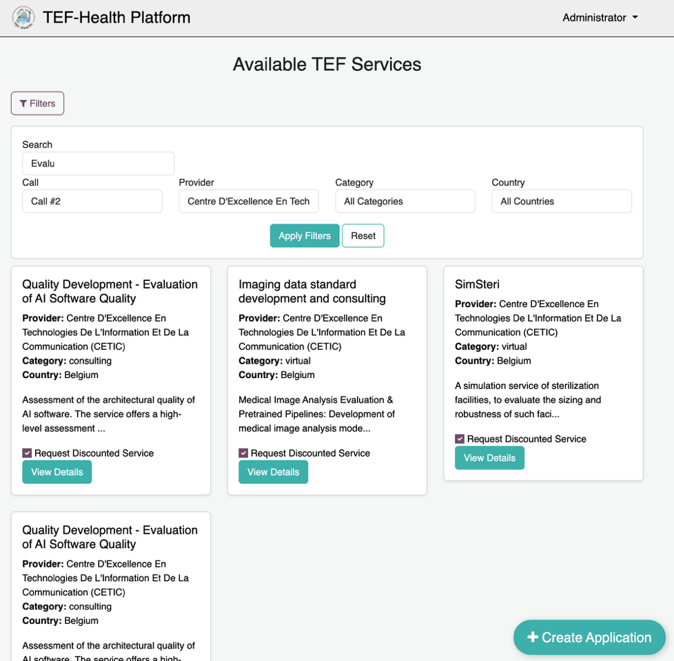
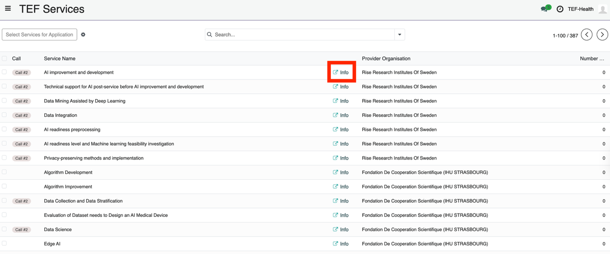
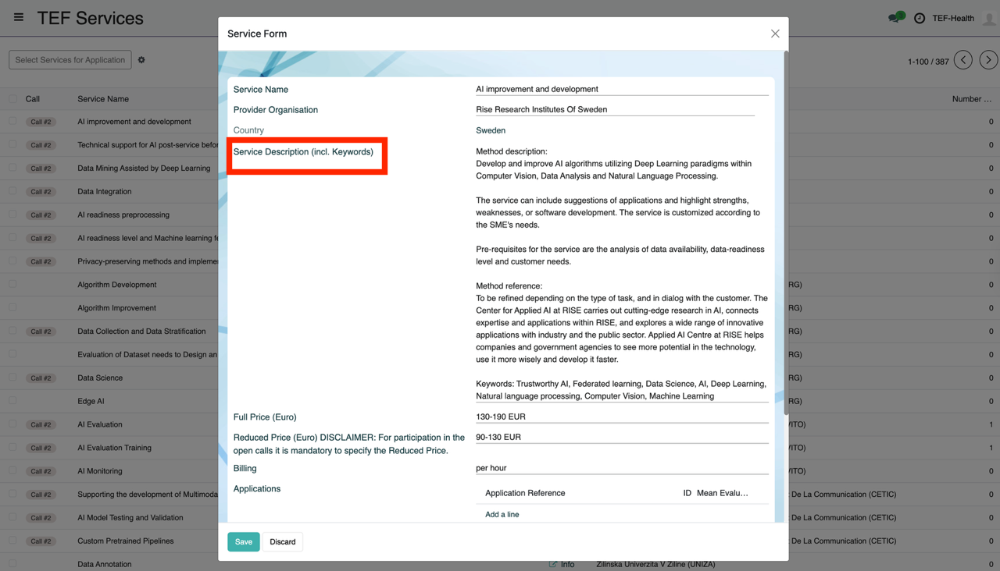
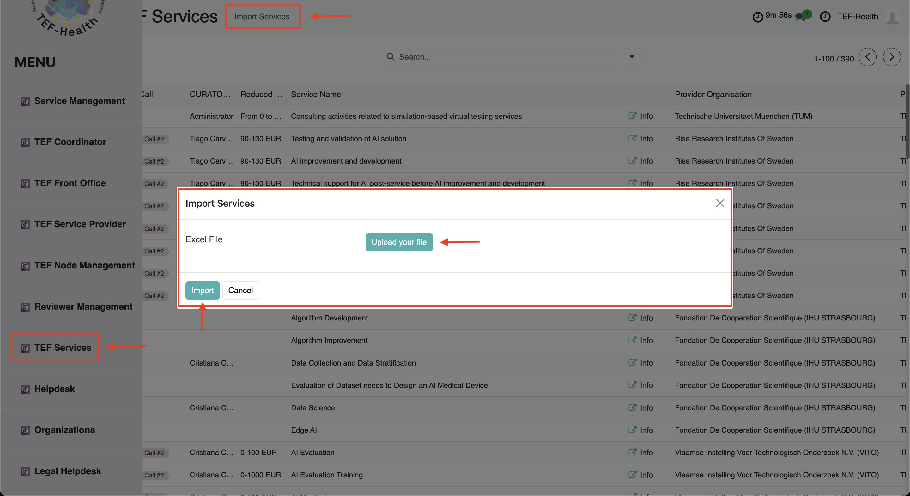
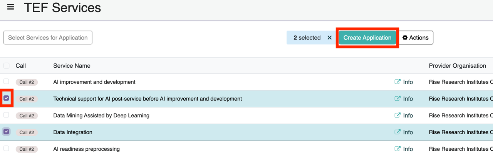
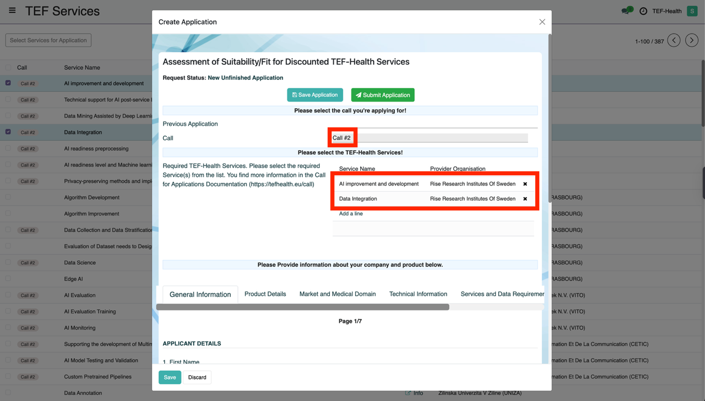

# Service Catalogue Guide

### Service Catalogue View
The Service Catalogue can be **searched by keywords and filtered by Call, Provider, Category and Country**.

Services can also be browsed as a list. 

Clicking on a list item opens a card with details of the Service.

### Import of Source of Truth Excel

Services are imported from a minimally processed version of the [TEF-Health-Service-Catalogue-latest.xlsx](https://github.com/TEF-Health/CONFIDENTIAL-Service-Catalogue/blob/main/TEF-Health-Service-Catalogue-latest.xlsx)

1. Download the Excel from GitHub and apply [this script](https://github.com/TEF-Health/CONFIDENTIAL_Odoo-modules/blob/main/code/import_ServiceCatalogueExcel.py) to clean and re-format the Excel to be compatible with the Odoo data model.   
2. Click on **TEF Services** in the left-hand menu to open the Services portal.
3. Click on **Import Service** in the top navigation bar and the select the output Excel file from step 2 for upload.

!!! info "Curator name"
    The Curator of each Service is specified in column A. Until a user with the corresponding name logged-in, the displayed name is ADMINISTRATOR.
            
    
### Service Form: adding, editing and removing Services

The Service Catalogue can be updated with a form that matches [the previous one](https://forms.office.com/e/Ndtm3PtavB). Batch-updates of Services can be imported as Excel spreadsheets.

### Application shortcut 

In addition to the [Application View](applicant.md), Applications can also be created by selecting services from the Service Catalogue.

Call and Services selection are already filled in.

