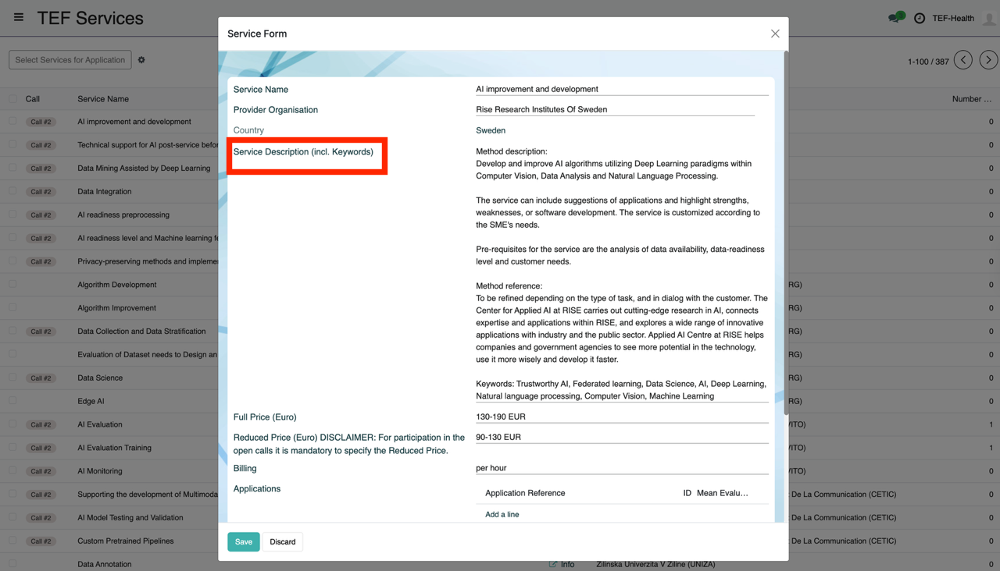

# Service Catalogue Guide

### Service Catalogue View
Services can be browsed as a list. 

Clicking on a list item opens a card with details of the Service.

### Import of Source of Truth Excel

All services are imported from a minimally processed version of the [TEF-Health-Service-Catalogue-latest.xlsx](https://github.com/TEF-Health/CONFIDENTIAL-Service-Catalogue/blob/main/TEF-Health-Service-Catalogue-latest.xlsx).

### Service Form: adding, editing and removing Services

The Service Catalogue can be updated with a form that matches [the previous one](https://forms.office.com/e/Ndtm3PtavB). Batch-updates of Services can be imported as Excel spreadsheets.

### Application shortcut 

In addition to the [Application View](applicant.md), Applications can also be created by selecting services from the Service Catalogue.

Call and Services selection are already filled in.

