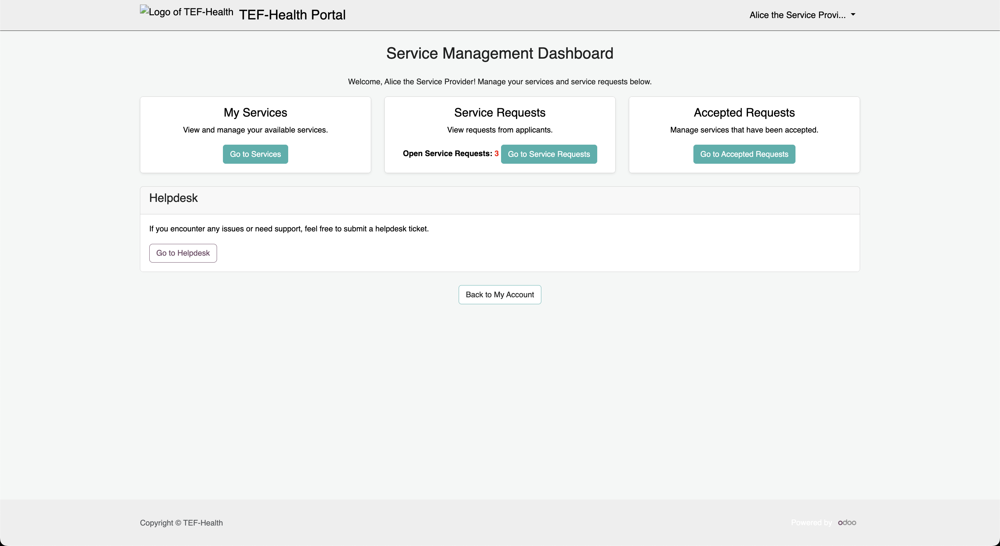
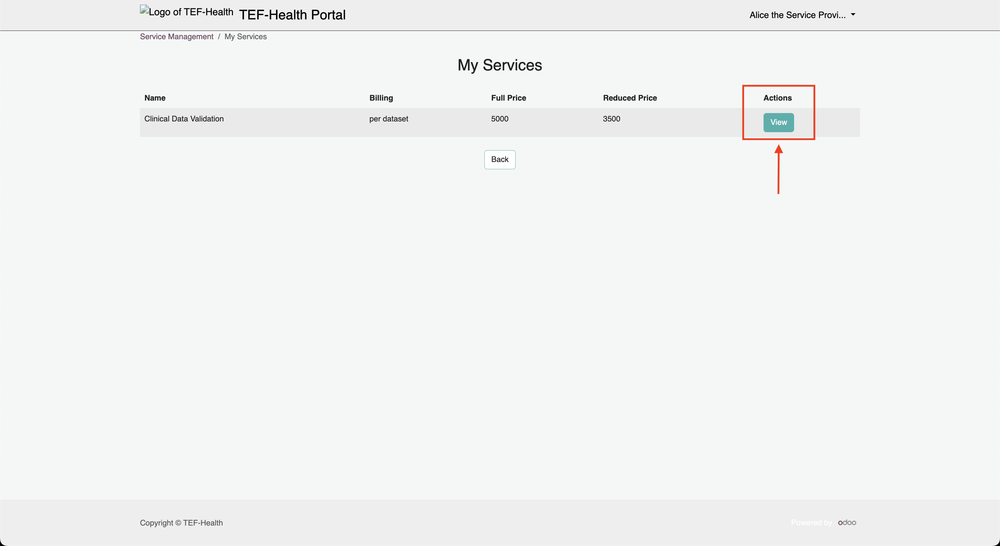
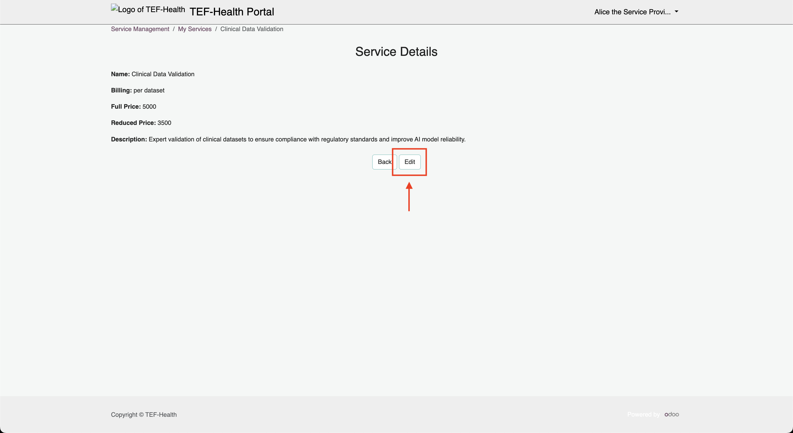
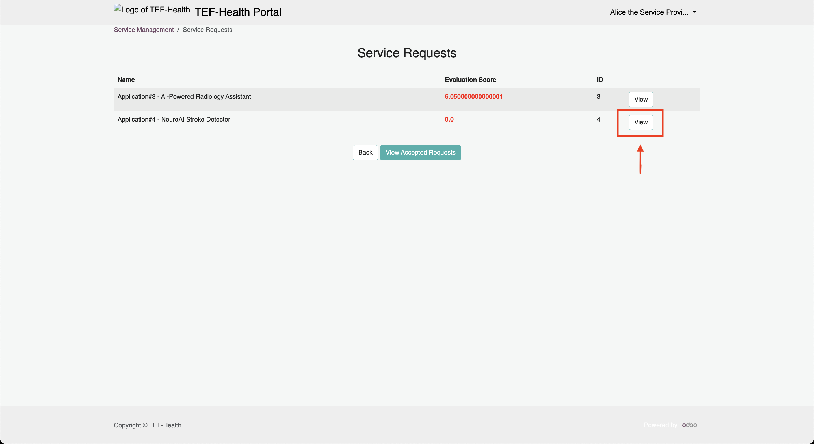
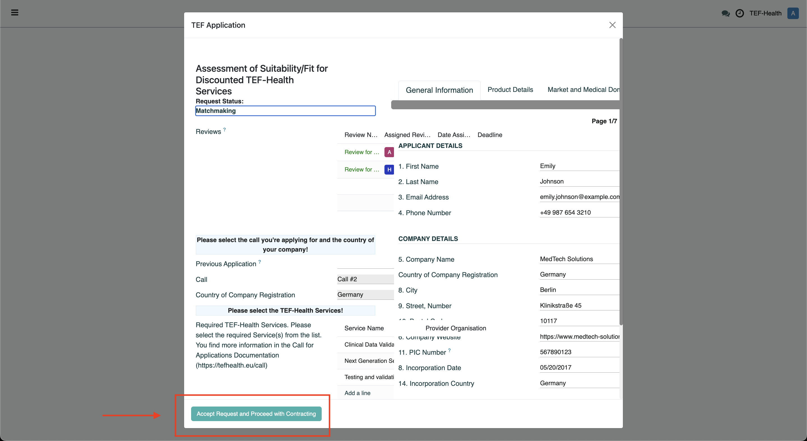
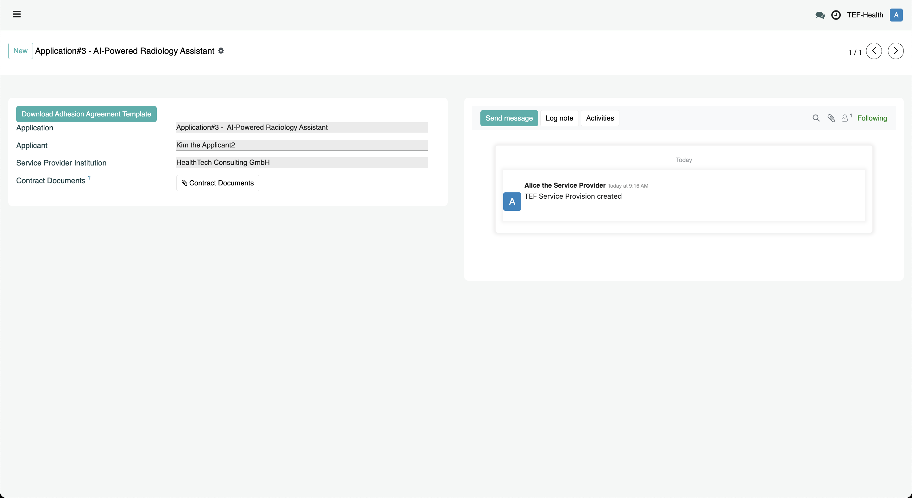

# Service Provider Guide

Service Providers **manage** their services, **review and negotiate applications**, and **ensure full compliance** with legal and State Aid requirements.

!!! tip "Key Aspects"
    - **Service Providers** offer services to SMEs via the **Service Catalogue**.
    - SMEs apply for discounts using the **Applicant** role.
    - Service Providers must agree to offer their Services in particular TEF-Health Calls.
    - **Reviewers** evaluate each application and provide a score.
    - Once approved by the **Coordinator**, Service Providers initiate contracting by creating an **Offer**.
    - A **Chatter** interface enables contract negotiation and communication.
    - **Ranking:** Applications are ranked by Score, yet Service Providers retain the freedom to select applications as they see fit.
    - Compliance with State Aid, eligibility criteria, and legal regulations is enforced through comprehensive documentation and record-keeping.

## Service Provider Dashboard
The Service Provider Dashboard can be accessed via the URL [https://tef.charite.de/portal/service_management](https://tef.charite.de/portal/service_management) or by clicking on the corresponding item in the left-hand menu. Via the Dashboard Service Providers can manage [Service Offerings](#service-offering-management), [Call Participation](#call-participation) [Service Requests](#service-request-management) and [Service Provisions](#service-provision-management).

### Service Offering Management

By clicking on **My Services** on the Service Provider Dashboard, Service Providers can **View** and **Edit** their Service Offerings. Click on the button **View** next to a list entry to view details. 

Click on the button **Edit** in the opening window to change details of the offering.

### Call Participation Management

> TODO: Service Providers indicate participation of each of their Offerings in a TEF-Health Call via dedicated Checkboxes. Service Providers receive a Notification to indicate participation when a new Call is prepared. 

### Service Request Management

By clicking on **Go to Service Requests** on the Service Provider Dashboard, Service Providers are presented with an overview of all reviewed applications for their services. Applications are sorted by the Reviewer Score for quick reference.Despite the ranking, Service Providers may choose to negotiate based on other factors. 

By clicking on the button **View** next to an Application, Service Providers can access the application details. On the opening card Service Providers can evaluate the application details and confirm a match by clicking the button **Accept Request and Proceed with Contracting**.

### Service Provision Management

Once a request was accepted, a new Service Provision Record is created and can be accessed from the Service Provider Dashboard via the button **Go to Accepted Requests**.

By clicking on **View Details** the Service Provision Record opens, which contains a Chatter to start communication between the Service Provider and the Applicant and for contract negotiation, ensuring both parties can discuss terms and clarify details such as Full and Reduced Prices. Via buttons, the contract documents are downloaded, locally signed, and then uploaded again.

!!! warning "State Aid Compliance"
    Service Providers must ensure that any discount negotiated complies with State Aid laws and all relevant national and regional regulations.

## Compliance & Documentation

Service Providers bear the responsibility to meet strict documentation and legal requirements:

- **Eligibility Verification:**  
  Verify SME eligibility and ensure compliance with all applicable laws and regulations.

- **Documentation Requirement (10-Year):**  
  Maintain a documented methodology for market price and discount calculations. This methodology must be verified by a qualified financial auditor.

- **Invoice Specifications:**  
  Every invoice must clearly state:
     - **Full Price**
     - **Reduced Price**
     - **Name of the Project/Funding Reference Number**

- **TRL Evidence:**  
  Provide a report showing evidence for both the start and exit Technology Readiness Levels (TRL).

!!! info "Audit Ready"
    Keeping detailed records not only ensures compliance but also prepares Service Providers for future audits and verifications.

