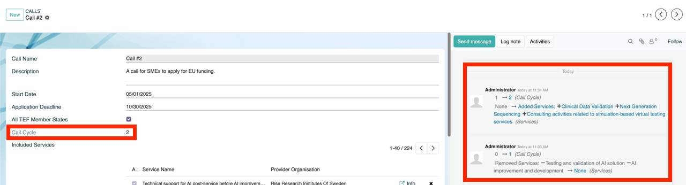

# Call Workflow

## Overview

Below is an overview of the process from service offering to final reporting:

| **Step**                  | **Role**           | **Action**                                                             | **Outcome**                                              |
|---------------------------|--------------------|------------------------------------------------------------------------|----------------------------------------------------------|
| **1. Service Offer**      | Service Provider   | Publish and manage services in the Catalogue                           | Updated and searchable Service Catalogue               |
| **2. Application**        | Applicant          | SMEs apply for service discounts                                       | Application submission                                 |
| **3. Reviewer assignment**| Front Office Agent | Assign 2-3 Reviewers to review the application                         | Review begin          |
| **4. Review**             | Reviewers          | Review applications                                                    | Application eligibile and scored          |
| **5. Approval**           | Coordinator        | Approve eligible applications                                          | Application approved for contract negotiations                   |
| **6. Contracting**| Service Provider & Applicant   | Create an Offer to begin the contracting process via Contact Card and Chatter for negotiations | Contract signed |
| **7. Service Provisioning** | Service Provider & Applicant            | Service Provider provides Service to Applicant           | Executed Service     |
| **8. Compliance & Documentation** | Service Provider | Enter final pricing details, document compliance, and prepare invoices | Fulfillment of legal and State Aid requirements          |

## Call cycles

Calls can consist of several cycles, in order to add, update, or remove Service Offerings during the course of a running Call. When Services have been changed a difference logger tracks and displays all changes and increases the “Cycle” counter by 1. Other changes are also tracked (like the deadline or Nodes included) but this does not affect the Cycle.
